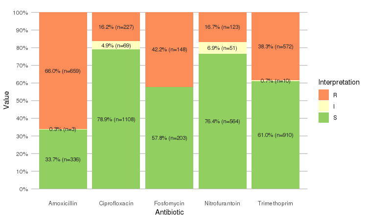
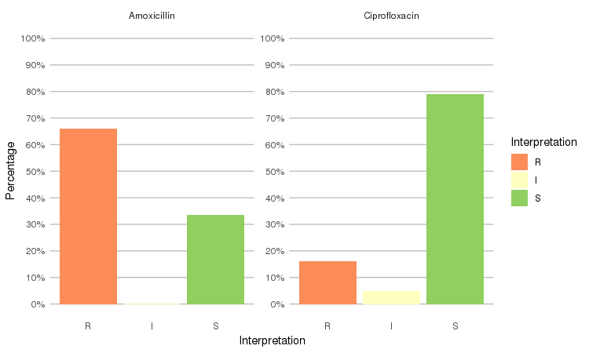
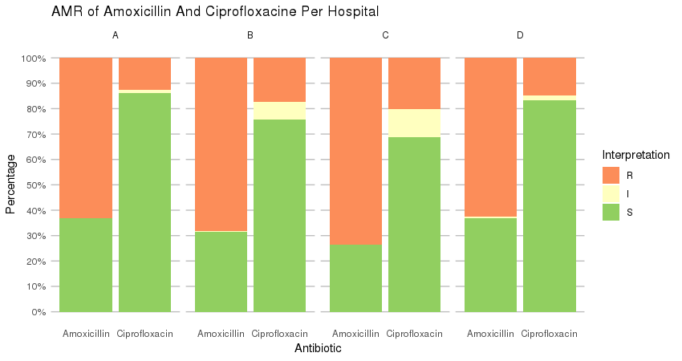

# `AMR`
### An [R package](https://www.r-project.org) to simplify the analysis and prediction of Antimicrobial Resistance (AMR) and work with antibiotic properties by using evidence-based methods.

This R package was created for academic research by PhD students of the Faculty of Medical Sciences of the [University of Groningen](https://www.rug.nl) and the Medical Microbiology & Infection Prevention (MMBI) department of the [University Medical Center Groningen (UMCG)](https://www.umcg.nl).

:arrow_forward: Get it with `install.packages("AMR")` or see below for other possibilities. Read all changes and new functions in [NEWS.md](NEWS.md).

## Authors
<a href="https://orcid.org/0000-0001-7620-1800"></a> Matthijs S. Berends<sup>1,2,a</sup>,
<a href="https://orcid.org/0000-0001-5809-5995"></a> Christian F. Luz<sup>1,a</sup>,
Erwin E.A. Hassing<sup>2</sup>,
<a href="https://orcid.org/0000-0003-1241-1328"></a> Corinna Glasner<sup>1,b</sup>,
<a href="https://orcid.org/0000-0003-4881-038X"></a> Alex W. Friedrich<sup>1,b</sup>,
<a href="https://orcid.org/0000-0003-1634-0010"></a> Bhanu Sinha<sup>1,b</sup>
  
<sup>1</sup> Department of Medical Microbiology, University of Groningen, University Medical Center Groningen, Groningen, the Netherlands - [rug.nl](http://www.rug.nl) [umcg.nl](http://www.umcg.nl)<br>
<sup>2</sup> Certe Medical Diagnostics & Advice, Groningen, the Netherlands - [certe.nl](http://www.certe.nl)<br>
<sup>a</sup> R package author and thesis dissertant<br>
<sup>b</sup> Thesis advisor

<a href="https://www.rug.nl"></a>
<a href="https://www.umcg.nl"></a>
<a href="https://www.certe.nl"></a>
<a href="http://www.eurhealth-1health.eu"></a>
<a href="http://www.eurhealth-1health.eu"></a>

## Contents
* [Why this package?](#why-this-package)
* [How to get it?](#how-to-get-it)
  * [Install from CRAN](#install-from-cran)
  * [Install from GitHub](#install-from-github)
* [How to use it?](#how-to-use-it)
  * [New classes](#new-classes)
  * [Overwrite/force resistance based on EUCAST rules](#overwriteforce-resistance-based-on-eucast-rules)
  * [Other (microbial) epidemiological functions](#other-microbial-epidemiological-functions)
  * [Frequency tables](#frequency-tables)
  * [Data sets included in package](#data-sets-included-in-package)
* [Copyright](#copyright)

## Why this package?
This R package was intended **to make microbial epidemiology easier**. Most functions contain extensive help pages to get started.

<a href="https://www.itis.gov"></a>

This `AMR` package contains the **complete microbial taxonomic data** (with seven taxonomic ranks - from subkingdom to subspecies) from the publicly available Integrated Taxonomic Information System (ITIS, https://www.itis.gov). ITIS is a partnership of U.S., Canadian, and Mexican agencies and taxonomic specialists. The complete taxonomic kingdoms Bacteria, Fungi and Protozoa are included in this package, as well as all previously accepted names known to ITIS. This allows users to use authoritative taxonomic information for their data analyses on any microorganisms, not only human pathogens.

Combined with several new functions, this `AMR` package basically does four important things:

1. It **cleanses existing data**, by transforming it to reproducible and profound *classes*, making the most efficient use of R. These functions all use artificial intelligence to guess results that you would expect:

   * Use `as.mo` to get an ID of a microorganism. The IDs are human readable for the trained eye - the ID of *Klebsiella pneumoniae* is "B_KLBSL_PNE" (B stands for Bacteria) and the ID of *S. aureus* is "B_STPHY_AUR". The function takes almost any text as input that looks like the name or code of a microorganism like "E. coli", "esco" and "esccol". Even `as.mo("MRSA")` will return the ID of *S. aureus*. Moreover, it can group all coagulase negative and positive *Staphylococci*, and can transform *Streptococci* into Lancefield groups. To find bacteria based on your input, it uses Artificial Intelligence to look up values in the included ITIS data, consisting of more than 18,000 microorganisms.
   * Use `as.rsi` to transform values to valid antimicrobial results. It produces just S, I or R based on your input and warns about invalid values. Even values like "<=0.002; S" (combined MIC/RSI) will result in "S".
   * Use `as.mic` to cleanse your MIC values. It produces a so-called factor (called *ordinal* in SPSS) with valid MIC values as levels. A value like "<=0.002; S" (combined MIC/RSI) will result in "<=0.002".
   * Use `as.atc` to get the ATC code of an antibiotic as defined by the WHO. This package contains a database with most LIS codes, official names, DDDs and even trade names of antibiotics. For example, the values "Furabid", "Furadantin", "nitro" all return the ATC code of Nitrofurantoine.
   
2. It **enhances existing data** and **adds new data** from data sets included in this package.

   * Use `EUCAST_rules` to apply [EUCAST expert rules to isolates](http://www.eucast.org/expert_rules_and_intrinsic_resistance/).
   * Use `first_isolate` to identify the first isolates of every patient [using guidelines from the CLSI](https://clsi.org/standards/products/microbiology/documents/m39/) (Clinical and Laboratory Standards Institute).
     * You can also identify first *weighted* isolates of every patient, an adjusted version of the CLSI guideline. This takes into account key antibiotics of every strain and compares them.
   * Use `MDRO` (abbreviation of Multi Drug Resistant Organisms) to check your isolates for exceptional resistance with country-specific guidelines or EUCAST rules. Currently, national guidelines for Germany and the Netherlands are supported.
   * The data set `microorganisms` contains the complete taxonomic tree of more than 18,000 microorganisms (bacteria, fungi/yeasts and protozoa). Furthermore, the colloquial name and Gram stain are available, which enables resistance analysis of e.g. different antibiotics per Gram stain. The package also contains functions to look up values in this data set like `mo_genus`, `mo_family`, `mo_gramstain` or even `mo_phylum`. As they use `as.mo` internally, they also use artificial intelligence. For example, `mo_genus("MRSA")` and `mo_genus("S. aureus")` will both return `"Staphylococcus"`. They also come with support for German, Dutch, French, Italian, Spanish and Portuguese. These functions can be used to add new variables to your data.
   * The data set `antibiotics` contains the ATC code, LIS codes, official name, trivial name and DDD of both oral and parenteral administration. It also contains a total of 298 trade names. Use functions like `ab_name` and `ab_tradenames` to look up values. The `ab_*` functions use `as.atc` internally so they support AI to guess your expected result. For example, `ab_name("Fluclox")`, `ab_name("Floxapen")` and `ab_name("J01CF05")` will all return `"Flucloxacillin"`. These functions can again be used to add new variables to your data.

3. It **analyses the data** with convenient functions that use well-known methods.

   * Calculate the resistance (and even co-resistance) of microbial isolates with the `portion_R`, `portion_IR`, `portion_I`, `portion_SI` and `portion_S` functions. Similarly, the *amount* of isolates can be determined with the `count_R`, `count_IR`, `count_I`, `count_SI` and `count_S` functions. All these functions can be used [with the `dplyr` package](https://dplyr.tidyverse.org/#usage) (e.g. in conjunction with [`summarise`](https://dplyr.tidyverse.org/reference/summarise.html))
   * Plot AMR results with `geom_rsi`, a function made for the `ggplot2` package
   * Predict antimicrobial resistance for the nextcoming years using logistic regression models with the `resistance_predict` function
   * Conduct descriptive statistics to enhance base R: calculate kurtosis, skewness and create frequency tables

4. It **teaches the user** how to use all the above actions.

   * The package contains extensive help pages with many examples.
   * It also contains an example data set called `septic_patients`. This data set contains:
     * 2,000 blood culture isolates from anonymised septic patients between 2001 and 2017 in the Northern Netherlands
     * Results of 40 antibiotics (each antibiotic in its own column) with a total of 38,414 antimicrobial results
     * Real and genuine data

## How to get it?
All stable versions of this package [are published on CRAN](http://cran.r-project.org/package=AMR), the official R network with a peer-reviewed submission process.

### Install from CRAN
[](http://cran.r-project.org/package=AMR) [](http://cran.r-project.org/package=AMR)

(Note: Downloads measured only by [cran.rstudio.com](https://cran.rstudio.com/package=AMR), this excludes e.g. the official [cran.r-project.org](https://cran.r-project.org/package=AMR))

-  Install using [RStudio](http://www.rstudio.com) (recommended):
  - Click on `Tools` and then `Install Packages...`
  - Type in `AMR` and press <kbd>Install</kbd>

-  Install in R directly:
  - `install.packages("AMR")`

### Install from GitHub

This is the latest **development version**. Although it may contain bugfixes and even new functions compared to the latest released version on CRAN, it is also subject to change and may be unstable or behave unexpectedly. Always consider this a beta version. All below 'badges' should be green:

Development Test | Result | Reference
--- | :---: | ---
Works on Linux and macOS | [](https://travis-ci.org/msberends/AMR) | Checked by Travis CI, GmbH [[ref 1]](https://travis-ci.org/msberends/AMR) 
Works on Windows | [](https://ci.appveyor.com/project/msberends/AMR) | Checked by Appveyor Systems Inc. [[ref 2]](https://ci.appveyor.com/project/msberends/AMR)
Syntax lines checked | [](https://codecov.io/gh/msberends/AMR) | Checked by Codecov LLC [[ref 3]](https://codecov.io/gh/msberends/AMR)

If so, try it with:
```r
install.packages("devtools") 
devtools::install_github("msberends/AMR")
```

### Install from Zenodo
[](https://doi.org/10.5281/zenodo.1305355)

This package was also published on Zenodo: https://doi.org/10.5281/zenodo.1305355

## How to use it?
```r
# Call it with:
library(AMR)

# For a list of functions:
help(package = "AMR")
```

### New classes
This package contains two new S3 classes: `mic` for MIC values (e.g. from Vitek or Phoenix) and `rsi` for antimicrobial drug interpretations (i.e. S, I and R). Both are actually ordered factors under the hood (an MIC of `2` being higher than `<=1` but lower than `>=32`, and for class `rsi` factors are ordered as `S < I < R`). 
Both classes have extensions for existing generic functions like `print`, `summary` and `plot`.

These functions also try to coerce valid values.

#### RSI
The `septic_patients` data set comes with antimicrobial results of more than 40 different drugs. For example, columns `amox` and `cipr` contain results of amoxicillin and ciprofloxacin, respectively.
```r
summary(septic_patients[, c("amox", "cipr")])
#      amox          cipr     
#  Mode  :rsi    Mode  :rsi   
#  <NA>  :1002   <NA>  :596   
#  Sum S :336    Sum S :1108  
#  Sum IR:662    Sum IR:296   
#  -Sum R:659    -Sum R:227   
#  -Sum I:3      -Sum I:69  
```

You can use the `plot` function from base R:
```r
plot(septic_patients$cipr)
```


Or use the `ggplot2` and `dplyr` packages to create more appealing plots:
```r
library(dplyr)
library(ggplot2)

septic_patients %>%
  select(amox, nitr, fosf, trim, cipr) %>%
  ggplot_rsi()
```



Adjust it with any parameter you know from the `ggplot2` package:

```r
septic_patients %>%
  select(amox, nitr, fosf, trim, cipr) %>%
  ggplot_rsi(datalabels = FALSE, 
             width = 0.5, colour = "black", size = 1, linetype = 2, alpha = 0.25)
```



It also supports grouping variables. Let's say we want to compare resistance of drugs against Urine Tract Infections (UTI) between hospitals A to D (variable `hospital_id`):

```r
septic_patients %>%
  select(hospital_id, amox, nitr, fosf, trim, cipr) %>%
  group_by(hospital_id) %>%
  ggplot_rsi(x = "hospital_id",
             facet = "Antibiotic",
             nrow = 1,
             datalabels = FALSE) +
  labs(title = "AMR of Anti-UTI Drugs Per Hospital",
       x = "Hospital")
```



You could use this to group on anything in your plots: Gram stain, age (group), genus, geographic location, et cetera.

#### MIC

```r
# Transform values to new class
mic_data <- as.mic(c(">=32", "1.0", "8", "<=0.128", "8", "16", "16"))

summary(mic_data)
#  Mode:mic      
#  <NA>:0        
#  Min.:<=0.128  
#  Max.:>=32 

plot(mic_data)
```


### Overwrite/force resistance based on EUCAST rules
This is also called *interpretive reading*.
```r
before <- data.frame(bact = c("STAAUR",  # Staphylococcus aureus
                                "ENCFAE",  # Enterococcus faecalis
                                "ESCCOL",  # Escherichia coli
                                "KLEPNE",  # Klebsiella pneumoniae
                                "PSEAER"), # Pseudomonas aeruginosa
                     vanc = "-",           # Vancomycin
                     amox = "-",           # Amoxicillin
                     coli = "-",           # Colistin
                     cfta = "-",           # Ceftazidime
                     cfur = "-",           # Cefuroxime
                     stringsAsFactors = FALSE)
before
#   bact   vanc amox coli cfta cfur
# 1 STAAUR    -    -    -    -    -
# 2 ENCFAE    -    -    -    -    -
# 3 ESCCOL    -    -    -    -    -
# 4 KLEPNE    -    -    -    -    -
# 5 PSEAER    -    -    -    -    -

# Now apply those rules; just need a column with bacteria IDs and antibiotic results:
after <- EUCAST_rules(before, col_mo = "bact")
after
#   bact   vanc amox coli cfta cfur
# 1 STAAUR    -    -    R    R    -
# 2 ENCFAE    -    -    R    R    R
# 3 ESCCOL    R    -    -    -    -
# 4 KLEPNE    R    R    -    -    -
# 5 PSEAER    R    R    -    -    R
```

Bacteria IDs can be retrieved with the `guess_mo` function. It uses any type of info about a microorganism as input. For example, all these will return value `STAAUR`, the ID of *S. aureus*:
```r
guess_mo("stau")
guess_mo("STAU")
guess_mo("staaur")
guess_mo("S. aureus")
guess_mo("S aureus")
guess_mo("Staphylococcus aureus")
guess_mo("MRSA") # Methicillin Resistant S. aureus
guess_mo("VISA") # Vancomycin Intermediate S. aureus
guess_mo("VRSA") # Vancomycin Resistant S. aureus
```

### Other (microbial) epidemiological functions

```r
# G-test to replace Chi squared test
g.test(...)

# Determine key antibiotic based on bacteria ID
key_antibiotics(...)

# Selection of first isolates of any patient
first_isolate(...)

# Calculate resistance levels of antibiotics, can be used with `summarise` (dplyr)
rsi(...)
# Predict resistance levels of antibiotics
rsi_predict(...)

# Get name of antibiotic by ATC code
abname(...)
abname("J01CR02", from = "atc", to = "umcg") # "AMCL"
```

### Frequency tables
Base R lacks a simple function to create frequency tables. We created such a function that works with almost all data types: `freq` (or `frequency_tbl`). It can be used in two ways:
```r
# Like base R:
freq(mydata$myvariable)

# And like tidyverse:
mydata %>% freq(myvariable)
```

Factors sort on item by default:
```r
septic_patients %>% freq(hospital_id)
# Frequency table of `hospital_id` 
# Class:     factor
# Length:    2000 (of which NA: 0 = 0.0%)
# Unique:    4
# 
#      Item    Count   Percent   Cum. Count   Cum. Percent   (Factor Level)
# ---  -----  ------  --------  -----------  -------------  ---------------
# 1    A         319     16.0%          319          16.0%                1
# 2    B         661     33.1%          980          49.0%                2
# 3    C         256     12.8%         1236          61.8%                3
# 4    D         764     38.2%         2000         100.0%                4
```

This can be changed with the `sort.count` parameter:
```r
septic_patients %>% freq(hospital_id, sort.count = TRUE)
# Frequency table of `hospital_id` 
# Class:     factor
# Length:    2000 (of which NA: 0 = 0.0%)
# Unique:    4
# 
#      Item    Count   Percent   Cum. Count   Cum. Percent   (Factor Level)
# ---  -----  ------  --------  -----------  -------------  ---------------
# 1    D         764     38.2%          764          38.2%                4
# 2    B         661     33.1%         1425          71.2%                2
# 3    A         319     16.0%         1744          87.2%                1
# 4    C         256     12.8%         2000         100.0%                3
```

All other types, like numbers, characters and dates, sort on count by default:
```r
septic_patients %>% freq(date)
# Frequency table of `date` 
# Class:     Date
# Length:    2000 (of which NA: 0 = 0.0%)
# Unique:    1151
# 
# Oldest:    2 January 2002
# Newest:    28 December 2017 (+5839)
# Median:    7 Augustus 2009 (~48%)
# 
#      Item          Count   Percent   Cum. Count   Cum. Percent
# ---  -----------  ------  --------  -----------  -------------
# 1    2016-05-21       10      0.5%           10           0.5%
# 2    2004-11-15        8      0.4%           18           0.9%
# 3    2013-07-29        8      0.4%           26           1.3%
# 4    2017-06-12        8      0.4%           34           1.7%
# 5    2015-11-19        7      0.4%           41           2.1%
# 6    2005-12-22        6      0.3%           47           2.4%
# 7    2015-10-12        6      0.3%           53           2.6%
# 8    2002-05-16        5      0.2%           58           2.9%
# 9    2004-02-02        5      0.2%           63           3.1%
# 10   2004-02-18        5      0.2%           68           3.4%
# 11   2005-08-16        5      0.2%           73           3.6%
# 12   2005-09-01        5      0.2%           78           3.9%
# 13   2006-06-29        5      0.2%           83           4.2%
# 14   2007-08-10        5      0.2%           88           4.4%
# 15   2008-08-29        5      0.2%           93           4.7%
# [ reached getOption("max.print.freq") -- omitted 1136 entries, n = 1907 (95.3%) ]
```
For numeric values, some extra descriptive statistics will be calculated:
```r
freq(runif(n = 10, min = 1, max = 5))
# Frequency table  
# Class:     numeric
# Length:    10 (of which NA: 0 = 0.0%)
# Unique:    10
# 
# Mean:      3.4
# Std. dev.: 1.3 (CV: 0.38, MAD: 1.3)
# Five-Num:  1.6 | 2.0 | 3.9 | 4.7 | 4.8 (IQR: 2.7, CQV: 0.4)
# Outliers:  0
# 
#           Item   Count   Percent   Cum. Count   Cum. Percent
# ---  ---------  ------  --------  -----------  -------------
# 1     1.568997       1     10.0%            1          10.0%
# 2     1.993575       1     10.0%            2          20.0%
# 3     2.022348       1     10.0%            3          30.0%
# 4     2.236038       1     10.0%            4          40.0%
# 5     3.579828       1     10.0%            5          50.0%
# 6     4.178081       1     10.0%            6          60.0%
# 7     4.394818       1     10.0%            7          70.0%
# 8     4.689871       1     10.0%            8          80.0%
# 9     4.698626       1     10.0%            9          90.0%
# 10    4.751488       1     10.0%           10         100.0%
# 
# Warning message:
# All observations are unique. 
```
Learn more about this function with:
```r
?freq
```

### Data sets included in package
Data sets to work with antibiotics and bacteria properties.
```r
# Data set with complete taxonomic trees from ITIS, containing of 
# the three kingdoms Bacteria, Fungi and Protozoa
microorganisms    # A tibble: 18,831 x 15

# Data set with 2000 random blood culture isolates from anonymised
# septic patients between 2001 and 2017 in 5 Dutch hospitals
septic_patients   # A tibble: 2,000 x 49

# Data set with ATC antibiotics codes, official names, trade names 
# and DDDs (oral and parenteral)
antibiotics       # A tibble: 423 x 18
```

## Copyright
[](https://github.com/msberends/AMR/blob/master/LICENSE)

This R package is licensed under the [GNU General Public License (GPL) v2.0](https://github.com/msberends/AMR/blob/master/LICENSE). In a nutshell, this means that this package:

- May be used for commercial purposes

- May be used for private purposes

- May **not** be used for patent purposes

- May be modified, although:

  - Modifications **must** be released under the same license when distributing the package
  - Changes made to the code **must** be documented

- May be distributed, although:

  - Source code **must** be made available when the package is distributed
  - A copy of the license and copyright notice **must** be included with the package.

- Comes with a LIMITATION of liability

- Comes with NO warranty
