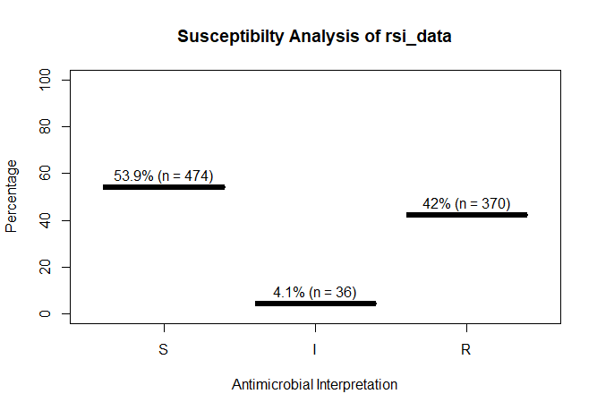

# `AMR`
This is an [R package](https://www.r-project.org) to simplify the analysis and prediction of Antimicrobial Resistance (AMR).


This R package was created for academic research by PhD students of the Faculty of Medical Sciences of the [University of Groningen](https://www.rug.nl/) and the Medical Microbiology & Infection Prevention department of the University Medical Center Groningen (UMCG). They also maintain this package, see [Authors](#authors).

## Why this package?
This R package contains functions to make microbiological, epidemiological data analysis easier. It allows the use of some new S3 classes to work with MIC values and antimicrobial interpretations (i.e. values S, I and R).

AMR can also be predicted for the forthcoming years with the `rsi_predict` function. For use with the `dplyr` package, the `rsi` function can be used in conjunction with `summarise` to calculate the resistance percentages of different antibiotic columns of a table.

It also contains functions to translate antibiotic codes from the lab (like `"AMOX"`) or the [WHO](https://www.whocc.no/atc_ddd_index/?code=J01CA04&showdescription=no) (like `"J01CA04"`) to trivial names (like `"amoxicillin"`) and vice versa.

## How to get it?
[](http://cran.r-project.org/package=AMR)[](http://cran.r-project.org/package=AMR)[](https://travis-ci.org/msberends/AMR)

This package is available on CRAN (latest stable version) and also here on GitHub (latest development version).

### Latest stable version from CRAN (recommended)
For RStudio:
-  Click on `Tools` and then `Install Packages...`
-  Type in `AMR` and press <kbd>Install</kbd>

Or in the R console:
```r
install.packages("AMR")
```

### Latest development version from GitHub
```r
devtools::install_github("msberends/AMR")
```

## How to use it?
```r
# Call it with:
library(AMR)

# For a list of functions:
help(package = "AMR")
```
### Overwrite/force resistance based on EUCAST rules
This is also called *interpretive reading*.
```r
before <- data.frame(bactid = c("STAAUR",  # Staphylococcus aureus
                                "ENCFAE"   # Enterococcus faecalis
                                "ESCCOL",  # Escherichia coli
                                "KLEPNE",  # Klebsiella pneumoniae
                                "PSEAER"), # Pseudomonas aeruginosa
                     vanc = "-",           # Vancomycin
                     amox = "-",           # Amoxicillin
                     coli = "-",           # Colistin
                     cfta = "-",           # Ceftazidime
                     cfur = "-",           # Cefuroxime
                     stringsAsFactors = FALSE)
before
#   bactid vanc amox coli cfta cfur
# 1 STAAUR    -    -    -    -    -
# 2 ENCFAE    -    -    -    -    -
# 3 ESCCOL    -    -    -    -    -
# 4 KLEPNE    -    -    -    -    -
# 5 PSEAER    -    -    -    -    -

# Now apply those rules; just need a column with bacteria ID's and antibiotic results:
after <- EUCAST_rules(before)
after
#   bactid vanc amox coli cfta cfur
# 1 STAAUR    -    -    R    R    -
# 2 ENCFAE    -    -    R    R    R
# 3 ESCCOL    R    -    -    -    -
# 4 KLEPNE    R    R    -    -    -
# 5 PSEAER    R    R    -    -    R
```

### New classes
This package contains two new S3 classes: `mic` for MIC values (e.g. from Vitek or Phoenix) and `rsi` for antimicrobial drug interpretations (i.e. S, I and R). Both are actually ordered factors under the hood (an MIC of `2` being higher than `<=1` but lower than `>=32`, and for class `rsi` factors are ordered as `S < I < R`). 
Both classes have extensions for existing generic functions like `print`, `summary` and `plot`.

```r
# Transform values to new classes
mic_data <- as.mic(c(">=32", "1.0", "8", "<=0.128", "8", "16", "16"))
rsi_data <- as.rsi(c(rep("S", 474), rep("I", 36), rep("R", 370)))
```
These functions also try to coerce valid values.

Quick overviews when just printing objects:
```r
mic_data
# Class 'mic': 7 isolates
# 
# <NA>  0
# 
# <=0.128       1       8      16    >=32
#       1       1       2       2       1

rsi_data
# Class 'rsi': 880 isolates
# 
# <NA>:       0 
# Sum of S:   474 
# Sum of IR:  406 
# - Sum of R: 370 
# - Sum of I: 36 
# 
#   %S  %IR   %I   %R 
# 53.9 46.1  4.1 42.0 
```

A plot of `rsi_data`:
```r
plot(rsi_data)
```



Other epidemiological functions:

```r
# Determine key antibiotic based on bacteria ID
key_antibiotics(...)

# Selection of first isolates of any patient
first_isolate(...)

# Calculate resistance levels of antibiotics, can be used with `summarise` (dplyr)
rsi(...)
# Predict resistance levels of antibiotics
rsi_predict(...)

# Get name of antibiotic by ATC code
abname(...)
abname("J01CR02", from = "atc", to = "umcg") # "AMCL"
```

### Databases included in package
Datasets to work with antibiotics and bacteria properties.
```r
# Dataset with ATC antibiotics codes, official names and DDD's (oral and parenteral)
ablist        # A tibble: 420 x 12

# Dataset with bacteria codes and properties like gram stain and aerobic/anaerobic
bactlist      # A tibble: 2,507 x 10
```


## Authors

  - [Berends MS](https://github.com/msberends)<sup>1,2</sup>, PhD Student
  - [Luz CF](https://github.com/ceefluz)<sup>1</sup>, PhD Student
  - [Hassing EEA](https://github.com/erwinhassing)<sup>2</sup>, Data Analyst (contributor)
  
<sup>1</sup> Department of Medical Microbiology, University of Groningen, University Medical Center Groningen, Groningen, the Netherlands

<sup>2</sup> Department of Medical, Market and Innovation (MMI), Certe Medische diagnostiek & advies, Groningen, the Netherlands

## Copyright
This R package is licensed under the [GNU General Public License (GPL) v2.0](https://github.com/msberends/AMR/blob/master/LICENSE). In a nutshell, this means that this package:

- May be used for commercial purposes

- May be used for private purposes

- May be modified, although:

  - Modifications **must** be released under the same license when distributing the package
  - Changes made to the code **must** be documented

- May be distributed, although:

  - Source code **must** be made available when the package is distributed
  - A copy of the license and copyright notice **must** be included with the package.

- Comes with a LIMITATION of liability

- Comes with NO warranty
