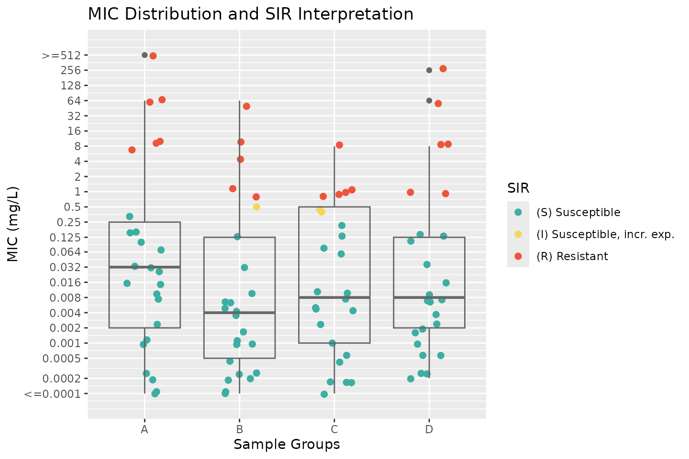
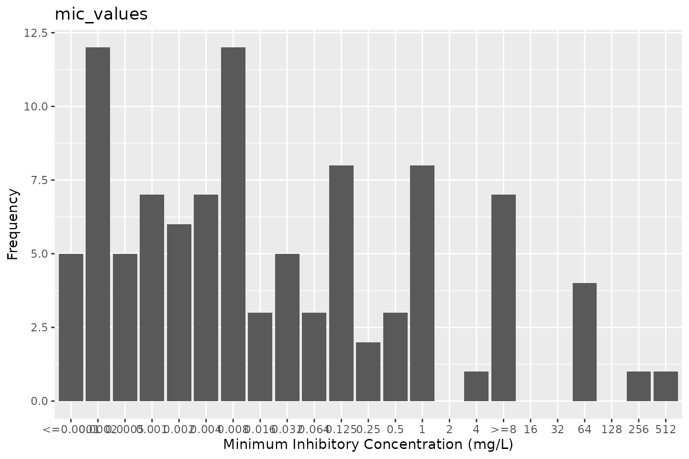
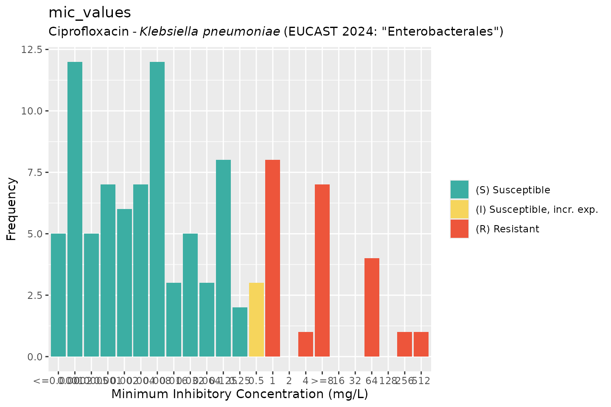

# Conduct AMR data analysis

**Note:** values on this page will change with every website update
since they are based on randomly created values and the page was written
in [R Markdown](https://rmarkdown.rstudio.com/). However, the
methodology remains unchanged. This page was generated on 16 January
2026.

## Introduction

Conducting AMR data analysis unfortunately requires in-depth knowledge
from different scientific fields, which makes it hard to do right. At
least, it requires:

- Good questions (always start with those!) and reliable data
- A thorough understanding of (clinical) epidemiology, to understand the
  clinical and epidemiological relevance and possible bias of results
- A thorough understanding of (clinical) microbiology/infectious
  diseases, to understand which microorganisms are causal to which
  infections and the implications of pharmaceutical treatment, as well
  as understanding intrinsic and acquired microbial resistance
- Experience with data analysis with microbiological tests and their
  results, to understand the determination and limitations of MIC values
  and their interpretations to SIR values
- Availability of the biological taxonomy of microorganisms and probably
  normalisation factors for pharmaceuticals, such as defined daily doses
  (DDD)
- Available (inter-)national guidelines, and profound methods to apply
  them

Of course, we cannot instantly provide you with knowledge and
experience. But with this `AMR` package, we aimed at providing (1) tools
to simplify antimicrobial resistance data cleaning, transformation and
analysis, (2) methods to easily incorporate international guidelines and
(3) scientifically reliable reference data, including the requirements
mentioned above.

The `AMR` package enables standardised and reproducible AMR data
analysis, with the application of evidence-based rules, determination of
first isolates, translation of various codes for microorganisms and
antimicrobial drugs, determination of (multi-drug) resistant
microorganisms, and calculation of antimicrobial resistance, prevalence
and future trends.

## Preparation

For this tutorial, we will create fake demonstration data to work with.

You can skip to [Cleaning the data](#cleaning-the-data) if you already
have your own data ready. If you start your analysis, try to make the
structure of your data generally look like this:

|    date    | patient_id |        mo        | AMX | CIP |
|:----------:|:----------:|:----------------:|:---:|:---:|
| 2026-01-16 |    abcd    | Escherichia coli |  S  |  S  |
| 2026-01-16 |    abcd    | Escherichia coli |  S  |  R  |
| 2026-01-16 |    efgh    | Escherichia coli |  R  |  S  |

### Needed R packages

As with many uses in R, we need some additional packages for AMR data
analysis. Our package works closely together with the [tidyverse
packages](https://www.tidyverse.org)
[`dplyr`](https://dplyr.tidyverse.org/) and
[`ggplot2`](https://ggplot2.tidyverse.org) by RStudio. The tidyverse
tremendously improves the way we conduct data science - it allows for a
very natural way of writing syntaxes and creating beautiful plots in R.

We will also use the `cleaner` package, that can be used for cleaning
data and creating frequency tables.

``` r
library(dplyr)
library(ggplot2)
library(AMR)

# (if not yet installed, install with:)
# install.packages(c("dplyr", "ggplot2", "AMR"))
```

The `AMR` package contains a data set `example_isolates_unclean`, which
might look data that users have extracted from their laboratory systems:

``` r
example_isolates_unclean
#> # A tibble: 3,000 × 8
#>    patient_id hospital date       bacteria      AMX   AMC   CIP   GEN  
#>    <chr>      <chr>    <date>     <chr>         <chr> <chr> <chr> <chr>
#>  1 J3         A        2012-11-21 E. coli       R     I     S     S    
#>  2 R7         A        2018-04-03 K. pneumoniae R     I     S     S    
#>  3 P3         A        2014-09-19 E. coli       R     S     S     S    
#>  4 P10        A        2015-12-10 E. coli       S     I     S     S    
#>  5 B7         A        2015-03-02 E. coli       S     S     S     S    
#>  6 W3         A        2018-03-31 S. aureus     R     S     R     S    
#>  7 J8         A        2016-06-14 E. coli       R     S     S     S    
#>  8 M3         A        2015-10-25 E. coli       R     S     S     S    
#>  9 J3         A        2019-06-19 E. coli       S     S     S     S    
#> 10 G6         A        2015-04-27 S. aureus     S     S     S     S    
#> # ℹ 2,990 more rows

# we will use 'our_data' as the data set name for this tutorial
our_data <- example_isolates_unclean
```

For AMR data analysis, we would like the microorganism column to contain
valid, up-to-date taxonomy, and the antibiotic columns to be cleaned as
SIR values as well.

### Taxonomy of microorganisms

With [`as.mo()`](https://amr-for-r.org/reference/as.mo.md), users can
transform arbitrary microorganism names or codes to current taxonomy.
The `AMR` package contains up-to-date taxonomic data. To be specific,
currently included data were retrieved on 24 Jun 2024.

The codes of the AMR packages that come from
[`as.mo()`](https://amr-for-r.org/reference/as.mo.md) are short, but
still human readable. More importantly,
[`as.mo()`](https://amr-for-r.org/reference/as.mo.md) supports all kinds
of input:

``` r
as.mo("Klebsiella pneumoniae")
#> Class 'mo'
#> [1] B_KLBSL_PNMN
as.mo("K. pneumoniae")
#> Class 'mo'
#> [1] B_KLBSL_PNMN
as.mo("KLEPNE")
#> Class 'mo'
#> [1] B_KLBSL_PNMN
as.mo("KLPN")
#> Class 'mo'
#> [1] B_KLBSL_PNMN
```

The first character in above codes denote their taxonomic kingdom, such
as Bacteria (B), Fungi (F), and Protozoa (P).

The `AMR` package also contain functions to directly retrieve taxonomic
properties, such as the name, genus, species, family, order, and even
Gram-stain. They all start with `mo_` and they use
[`as.mo()`](https://amr-for-r.org/reference/as.mo.md) internally, so
that still any arbitrary user input can be used:

``` r
mo_family("K. pneumoniae")
#> [1] "Enterobacteriaceae"
mo_genus("K. pneumoniae")
#> [1] "Klebsiella"
mo_species("K. pneumoniae")
#> [1] "pneumoniae"

mo_gramstain("Klebsiella pneumoniae")
#> [1] "Gram-negative"

mo_ref("K. pneumoniae")
#> [1] "Trevisan, 1887"

mo_snomed("K. pneumoniae")
#> [[1]]
#> [1] "1098101000112102" "446870005"        "1098201000112108" "409801009"       
#> [5] "56415008"         "714315002"        "713926009"
```

Now we can thus clean our data:

``` r
our_data$bacteria <- as.mo(our_data$bacteria, info = TRUE)
#> ℹ Retrieved values from the `microorganisms.codes` data set for "ESCCOL",
#>   "KLEPNE", "STAAUR", and "STRPNE".
#> ℹ Microorganism translation was uncertain for four microorganisms. Run
#>   `mo_uncertainties()` to review these uncertainties, or use
#>   `add_custom_microorganisms()` to add custom entries.
```

Apparently, there was some uncertainty about the translation to
taxonomic codes. Let’s check this:

``` r
mo_uncertainties()
#> Matching scores are based on the resemblance between the input and the full
#> taxonomic name, and the pathogenicity in humans. See `?mo_matching_score`.
#> Colour keys:  0.000-0.549  0.550-0.649  0.650-0.749  0.750-1.000 
#> 
#> --------------------------------------------------------------------------------
#> "E. coli" -> Escherichia coli (B_ESCHR_COLI, 0.688)
#> Also matched: Enterococcus crotali (0.650), Escherichia coli coli
#>               (0.643), Escherichia coli expressing (0.611), Enterobacter cowanii
#>               (0.600), Enterococcus columbae (0.595), Enterococcus camelliae (0.591),
#>               Enterococcus casseliflavus (0.577), Enterobacter cloacae cloacae
#>               (0.571), Enterobacter cloacae complex (0.571), and Enterobacter cloacae
#>               dissolvens (0.565)
#> --------------------------------------------------------------------------------
#> "K. pneumoniae" -> Klebsiella pneumoniae (B_KLBSL_PNMN, 0.786)
#> Also matched: Klebsiella pneumoniae complex (0.707), Klebsiella
#>               pneumoniae ozaenae (0.707), Klebsiella pneumoniae pneumoniae (0.688),
#>               Klebsiella pneumoniae rhinoscleromatis (0.658), Klebsiella pasteurii
#>               (0.500), Klebsiella planticola (0.500), Kingella potus (0.400),
#>               Kluyveromyces pseudotropicale (0.386), Kluyveromyces pseudotropicalis
#>               (0.363), and Kosakonia pseudosacchari (0.361)
#> --------------------------------------------------------------------------------
#> "S. aureus" -> Staphylococcus aureus (B_STPHY_AURS, 0.690)
#> Also matched: Staphylococcus aureus aureus (0.643), Staphylococcus
#>               argenteus (0.625), Staphylococcus aureus anaerobius (0.625),
#>               Staphylococcus auricularis (0.615), Salmonella Aurelianis (0.595),
#>               Salmonella Aarhus (0.588), Salmonella Amounderness (0.587),
#>               Staphylococcus argensis (0.587), Streptococcus australis (0.587), and
#>               Salmonella choleraesuis arizonae (0.562)
#> --------------------------------------------------------------------------------
#> "S. pneumoniae" -> Streptococcus pneumoniae (B_STRPT_PNMN, 0.750)
#> Also matched: Streptococcus pseudopneumoniae (0.700), Streptococcus
#>               phocae salmonis (0.552), Serratia proteamaculans quinovora (0.545),
#>               Streptococcus pseudoporcinus (0.536), Staphylococcus piscifermentans
#>               (0.533), Staphylococcus pseudintermedius (0.532), Serratia
#>               proteamaculans proteamaculans (0.526), Streptococcus gallolyticus
#>               pasteurianus (0.526), Salmonella Portanigra (0.524), and Streptococcus
#>               periodonticum (0.519)
#> 
#> Only the first 10 other matches of each record are shown. Run
#> `print(mo_uncertainties(), n = ...)` to view more entries, or save
#> `mo_uncertainties()` to an object.
```

That’s all good.

### Antibiotic results

The column with antibiotic test results must also be cleaned. The `AMR`
package comes with three new data types to work with such test results:
`mic` for minimal inhibitory concentrations (MIC), `disk` for disk
diffusion diameters, and `sir` for SIR data that have been interpreted
already. This package can also determine SIR values based on MIC or disk
diffusion values, read more about that on the
[`as.sir()`](https://amr-for-r.org/reference/as.sir.md) page.

For now, we will just clean the SIR columns in our data using dplyr:

``` r
# method 1, be explicit about the columns:
our_data <- our_data %>%
  mutate_at(vars(AMX:GEN), as.sir)

# method 2, let the AMR package determine the eligible columns
our_data <- our_data %>%
  mutate_if(is_sir_eligible, as.sir)

# result:
our_data
#> # A tibble: 3,000 × 8
#>    patient_id hospital date       bacteria     AMX   AMC   CIP   GEN  
#>    <chr>      <chr>    <date>     <mo>         <sir> <sir> <sir> <sir>
#>  1 J3         A        2012-11-21 B_ESCHR_COLI   R     I     S     S  
#>  2 R7         A        2018-04-03 B_KLBSL_PNMN   R     I     S     S  
#>  3 P3         A        2014-09-19 B_ESCHR_COLI   R     S     S     S  
#>  4 P10        A        2015-12-10 B_ESCHR_COLI   S     I     S     S  
#>  5 B7         A        2015-03-02 B_ESCHR_COLI   S     S     S     S  
#>  6 W3         A        2018-03-31 B_STPHY_AURS   R     S     R     S  
#>  7 J8         A        2016-06-14 B_ESCHR_COLI   R     S     S     S  
#>  8 M3         A        2015-10-25 B_ESCHR_COLI   R     S     S     S  
#>  9 J3         A        2019-06-19 B_ESCHR_COLI   S     S     S     S  
#> 10 G6         A        2015-04-27 B_STPHY_AURS   S     S     S     S  
#> # ℹ 2,990 more rows
```

This is basically it for the cleaning, time to start the data inclusion.

### First isolates

We need to know which isolates we can *actually* use for analysis
without repetition bias.

To conduct an analysis of antimicrobial resistance, you must [only
include the first isolate of every patient per
episode](https:/pubmed.ncbi.nlm.nih.gov/17304462/) (Hindler *et al.*,
Clin Infect Dis. 2007). If you would not do this, you could easily get
an overestimate or underestimate of the resistance of an antibiotic.
Imagine that a patient was admitted with an MRSA and that it was found
in 5 different blood cultures the following weeks (yes, some countries
like the Netherlands have these blood drawing policies). The resistance
percentage of oxacillin of all isolates would be overestimated, because
you included this MRSA more than once. It would clearly be [selection
bias](https://en.wikipedia.org/wiki/Selection_bias).

The Clinical and Laboratory Standards Institute (CLSI) appoints this as
follows:

> *(…) When preparing a cumulative antibiogram to guide clinical
> decisions about empirical antimicrobial therapy of initial infections,
> **only the first isolate of a given species per patient, per analysis
> period (eg, one year) should be included, irrespective of body site,
> antimicrobial susceptibility profile, or other phenotypical
> characteristics (eg, biotype)**. The first isolate is easily
> identified, and cumulative antimicrobial susceptibility test data
> prepared using the first isolate are generally comparable to
> cumulative antimicrobial susceptibility test data calculated by other
> methods, providing duplicate isolates are excluded.*  
> [M39-A4 Analysis and Presentation of Cumulative Antimicrobial
> Susceptibility Test Data, 4th Edition. CLSI, 2014. Chapter
> 6.4](https://clsi.org/standards/products/microbiology/documents/m39/)

This `AMR` package includes this methodology with the
[`first_isolate()`](https://amr-for-r.org/reference/first_isolate.md)
function and is able to apply the four different methods as defined by
[Hindler *et al.* in
2007](https://academic.oup.com/cid/article/44/6/867/364325):
phenotype-based, episode-based, patient-based, isolate-based. The right
method depends on your goals and analysis, but the default
phenotype-based method is in any case the method to properly correct for
most duplicate isolates. Read more about the methods on the
[`first_isolate()`](https://amr-for-r.org/reference/first_isolate.md)
page.

The outcome of the function can easily be added to our data:

``` r
our_data <- our_data %>%
  mutate(first = first_isolate(info = TRUE))
#> ℹ Determining first isolates using an episode length of 365 days
#> ℹ Using column 'bacteria' as input for `col_mo`.
#> ℹ Column 'first' is SIR eligible (despite only having empty values), since
#>   it seems to be cefozopran (ZOP)
#> ℹ Using column 'date' as input for `col_date`.
#> ℹ Using column 'patient_id' as input for `col_patient_id`.
#> ℹ Basing inclusion on all antimicrobial results, using a points threshold
#>   of 2
#> => Found 2,730 'phenotype-based' first isolates (91.0% of total where a
#>    microbial ID was available)
```

So only 91% is suitable for resistance analysis! We can now filter on it
with the [`filter()`](https://dplyr.tidyverse.org/reference/filter.html)
function, also from the `dplyr` package:

``` r
our_data_1st <- our_data %>%
  filter(first == TRUE)
```

For future use, the above two syntaxes can be shortened:

``` r
our_data_1st <- our_data %>%
  filter_first_isolate()
```

So we end up with 2 730 isolates for analysis. Now our data looks like:

``` r
our_data_1st
#> # A tibble: 2,730 × 9
#>    patient_id hospital date       bacteria     AMX   AMC   CIP   GEN   first
#>    <chr>      <chr>    <date>     <mo>         <sir> <sir> <sir> <sir> <lgl>
#>  1 J3         A        2012-11-21 B_ESCHR_COLI   R     I     S     S   TRUE 
#>  2 R7         A        2018-04-03 B_KLBSL_PNMN   R     I     S     S   TRUE 
#>  3 P3         A        2014-09-19 B_ESCHR_COLI   R     S     S     S   TRUE 
#>  4 P10        A        2015-12-10 B_ESCHR_COLI   S     I     S     S   TRUE 
#>  5 B7         A        2015-03-02 B_ESCHR_COLI   S     S     S     S   TRUE 
#>  6 W3         A        2018-03-31 B_STPHY_AURS   R     S     R     S   TRUE 
#>  7 M3         A        2015-10-25 B_ESCHR_COLI   R     S     S     S   TRUE 
#>  8 J3         A        2019-06-19 B_ESCHR_COLI   S     S     S     S   TRUE 
#>  9 G6         A        2015-04-27 B_STPHY_AURS   S     S     S     S   TRUE 
#> 10 P4         A        2011-06-21 B_ESCHR_COLI   S     S     S     S   TRUE 
#> # ℹ 2,720 more rows
```

Time for the analysis.

## Analysing the data

The base R [`summary()`](https://rdrr.io/r/base/summary.html) function
gives a good first impression, as it comes with support for the new `mo`
and `sir` classes that we now have in our data set:

``` r
summary(our_data_1st)
#>   patient_id          hospital              date           
#>  Length:2730        Length:2730        Min.   :2011-01-01  
#>  Class :character   Class :character   1st Qu.:2013-04-06  
#>  Mode  :character   Mode  :character   Median :2015-06-04  
#>                                        Mean   :2015-06-09  
#>                                        3rd Qu.:2017-08-14  
#>                                        Max.   :2019-12-27  
#>    bacteria               AMX                    AMC                
#>  Class :mo             Class:sir              Class:sir             
#>  <NA>  :0              %S   :40.1% (n=1071)   %S   :51.1% (n=1354)  
#>  Unique:4              %SDD : 0.0% (n=0)      %SDD : 0.0% (n=0)     
#>  #1    :B_ESCHR_COLI   %I   :17.0% (n=453)    %I   :12.7% (n=335)   
#>  #2    :B_STPHY_AURS   %R   :42.9% (n=1147)   %R   :36.2% (n=959)   
#>  #3    :B_STRPT_PNMN   %NI  : 0.0% (n=0)      %NI  : 0.0% (n=0)     
#>     CIP                    GEN                  first        
#>  Class:sir              Class:sir              Mode:logical  
#>  %S   :52.2% (n=1426)   %S   :60.7% (n=1656)   TRUE:2730     
#>  %SDD : 0.0% (n=0)      %SDD : 0.0% (n=0)                    
#>  %I   : 6.5% (n=178)    %I   : 3.0% (n=83)                   
#>  %R   :41.2% (n=1126)   %R   :36.3% (n=991)                  
#>  %NI  : 0.0% (n=0)      %NI  : 0.0% (n=0)

glimpse(our_data_1st)
#> Rows: 2,730
#> Columns: 9
#> $ patient_id <chr> "J3", "R7", "P3", "P10", "B7", "W3", "M3", "J3", "G6", "P4"…
#> $ hospital   <chr> "A", "A", "A", "A", "A", "A", "A", "A", "A", "A", "A", "A",…
#> $ date       <date> 2012-11-21, 2018-04-03, 2014-09-19, 2015-12-10, 2015-03-02…
#> $ bacteria   <mo> "B_ESCHR_COLI", "B_KLBSL_PNMN", "B_ESCHR_COLI", "B_ESCHR_COL…
#> $ AMX        <sir> R, R, R, S, S, R, R, S, S, S, S, R, S, S, R, R, R, R, S, R,…
#> $ AMC        <sir> I, I, S, I, S, S, S, S, S, S, S, S, S, S, S, S, S, R, S, S,…
#> $ CIP        <sir> S, S, S, S, S, R, S, S, S, S, S, S, S, S, S, S, S, S, S, S,…
#> $ GEN        <sir> S, S, S, S, S, S, S, S, S, S, S, R, S, S, S, S, S, S, S, S,…
#> $ first      <lgl> TRUE, TRUE, TRUE, TRUE, TRUE, TRUE, TRUE, TRUE, TRUE, TRUE,…

# number of unique values per column:
sapply(our_data_1st, n_distinct)
#> patient_id   hospital       date   bacteria        AMX        AMC        CIP 
#>        260          3       1854          4          4          4          3 
#>        GEN      first 
#>          3          1
```

### Availability of species

To just get an idea how the species are distributed, create a frequency
table with [`count()`](https://amr-for-r.org/reference/count.md) based
on the name of the microorganisms:

``` r
our_data %>%
  count(mo_name(bacteria), sort = TRUE)
#> # A tibble: 4 × 2
#>   `mo_name(bacteria)`          n
#>   <chr>                    <int>
#> 1 Escherichia coli          1518
#> 2 Staphylococcus aureus      730
#> 3 Streptococcus pneumoniae   426
#> 4 Klebsiella pneumoniae      326

our_data_1st %>%
  count(mo_name(bacteria), sort = TRUE)
#> # A tibble: 4 × 2
#>   `mo_name(bacteria)`          n
#>   <chr>                    <int>
#> 1 Escherichia coli          1326
#> 2 Staphylococcus aureus      684
#> 3 Streptococcus pneumoniae   401
#> 4 Klebsiella pneumoniae      319
```

### Select and filter with antibiotic selectors

Using so-called antibiotic class selectors, you can select or filter
columns based on the antibiotic class that your antibiotic results are
in:

``` r
our_data_1st %>%
  select(date, aminoglycosides())
#> ℹ For `aminoglycosides()` using column 'GEN' (gentamicin)
#> # A tibble: 2,730 × 2
#>    date       GEN  
#>    <date>     <sir>
#>  1 2012-11-21   S  
#>  2 2018-04-03   S  
#>  3 2014-09-19   S  
#>  4 2015-12-10   S  
#>  5 2015-03-02   S  
#>  6 2018-03-31   S  
#>  7 2015-10-25   S  
#>  8 2019-06-19   S  
#>  9 2015-04-27   S  
#> 10 2011-06-21   S  
#> # ℹ 2,720 more rows

our_data_1st %>%
  select(bacteria, betalactams())
#> ℹ For `betalactams()` using columns 'AMX' (amoxicillin) and 'AMC'
#>   (amoxicillin/clavulanic acid)
#> # A tibble: 2,730 × 3
#>    bacteria     AMX   AMC  
#>    <mo>         <sir> <sir>
#>  1 B_ESCHR_COLI   R     I  
#>  2 B_KLBSL_PNMN   R     I  
#>  3 B_ESCHR_COLI   R     S  
#>  4 B_ESCHR_COLI   S     I  
#>  5 B_ESCHR_COLI   S     S  
#>  6 B_STPHY_AURS   R     S  
#>  7 B_ESCHR_COLI   R     S  
#>  8 B_ESCHR_COLI   S     S  
#>  9 B_STPHY_AURS   S     S  
#> 10 B_ESCHR_COLI   S     S  
#> # ℹ 2,720 more rows

our_data_1st %>%
  select(bacteria, where(is.sir))
#> # A tibble: 2,730 × 5
#>    bacteria     AMX   AMC   CIP   GEN  
#>    <mo>         <sir> <sir> <sir> <sir>
#>  1 B_ESCHR_COLI   R     I     S     S  
#>  2 B_KLBSL_PNMN   R     I     S     S  
#>  3 B_ESCHR_COLI   R     S     S     S  
#>  4 B_ESCHR_COLI   S     I     S     S  
#>  5 B_ESCHR_COLI   S     S     S     S  
#>  6 B_STPHY_AURS   R     S     R     S  
#>  7 B_ESCHR_COLI   R     S     S     S  
#>  8 B_ESCHR_COLI   S     S     S     S  
#>  9 B_STPHY_AURS   S     S     S     S  
#> 10 B_ESCHR_COLI   S     S     S     S  
#> # ℹ 2,720 more rows

# filtering using AB selectors is also possible:
our_data_1st %>%
  filter(any(aminoglycosides() == "R"))
#> ℹ For `aminoglycosides()` using column 'GEN' (gentamicin)
#> # A tibble: 991 × 9
#>    patient_id hospital date       bacteria     AMX   AMC   CIP   GEN   first
#>    <chr>      <chr>    <date>     <mo>         <sir> <sir> <sir> <sir> <lgl>
#>  1 J5         A        2017-12-25 B_STRPT_PNMN   R     S     S     R   TRUE 
#>  2 X1         A        2017-07-04 B_STPHY_AURS   R     S     S     R   TRUE 
#>  3 B3         A        2016-07-24 B_ESCHR_COLI   S     S     S     R   TRUE 
#>  4 V7         A        2012-04-03 B_ESCHR_COLI   S     S     S     R   TRUE 
#>  5 C9         A        2017-03-23 B_ESCHR_COLI   S     S     S     R   TRUE 
#>  6 R1         A        2018-06-10 B_STPHY_AURS   S     S     S     R   TRUE 
#>  7 S2         A        2013-07-19 B_STRPT_PNMN   S     S     S     R   TRUE 
#>  8 P5         A        2019-03-09 B_STPHY_AURS   S     S     S     R   TRUE 
#>  9 Q8         A        2019-08-10 B_STPHY_AURS   S     S     S     R   TRUE 
#> 10 K5         A        2013-03-15 B_STRPT_PNMN   S     S     S     R   TRUE 
#> # ℹ 981 more rows

our_data_1st %>%
  filter(all(betalactams() == "R"))
#> ℹ For `betalactams()` using columns 'AMX' (amoxicillin) and 'AMC'
#>   (amoxicillin/clavulanic acid)
#> # A tibble: 461 × 9
#>    patient_id hospital date       bacteria     AMX   AMC   CIP   GEN   first
#>    <chr>      <chr>    <date>     <mo>         <sir> <sir> <sir> <sir> <lgl>
#>  1 M7         A        2013-07-22 B_STRPT_PNMN   R     R     S     S   TRUE 
#>  2 R10        A        2013-12-20 B_STPHY_AURS   R     R     S     S   TRUE 
#>  3 R7         A        2015-10-25 B_STPHY_AURS   R     R     S     S   TRUE 
#>  4 R8         A        2019-10-25 B_STPHY_AURS   R     R     S     S   TRUE 
#>  5 B6         A        2016-11-20 B_ESCHR_COLI   R     R     R     R   TRUE 
#>  6 I7         A        2015-08-19 B_ESCHR_COLI   R     R     S     S   TRUE 
#>  7 N3         A        2014-12-29 B_STRPT_PNMN   R     R     R     S   TRUE 
#>  8 Q2         A        2019-09-22 B_ESCHR_COLI   R     R     S     S   TRUE 
#>  9 X7         A        2011-03-20 B_ESCHR_COLI   R     R     S     R   TRUE 
#> 10 V1         A        2018-08-07 B_STPHY_AURS   R     R     S     S   TRUE 
#> # ℹ 451 more rows

# even works in base R (since R 3.0):
our_data_1st[all(betalactams() == "R"), ]
#> ℹ For `betalactams()` using columns 'AMX' (amoxicillin) and 'AMC'
#>   (amoxicillin/clavulanic acid)
#> # A tibble: 461 × 9
#>    patient_id hospital date       bacteria     AMX   AMC   CIP   GEN   first
#>    <chr>      <chr>    <date>     <mo>         <sir> <sir> <sir> <sir> <lgl>
#>  1 M7         A        2013-07-22 B_STRPT_PNMN   R     R     S     S   TRUE 
#>  2 R10        A        2013-12-20 B_STPHY_AURS   R     R     S     S   TRUE 
#>  3 R7         A        2015-10-25 B_STPHY_AURS   R     R     S     S   TRUE 
#>  4 R8         A        2019-10-25 B_STPHY_AURS   R     R     S     S   TRUE 
#>  5 B6         A        2016-11-20 B_ESCHR_COLI   R     R     R     R   TRUE 
#>  6 I7         A        2015-08-19 B_ESCHR_COLI   R     R     S     S   TRUE 
#>  7 N3         A        2014-12-29 B_STRPT_PNMN   R     R     R     S   TRUE 
#>  8 Q2         A        2019-09-22 B_ESCHR_COLI   R     R     S     S   TRUE 
#>  9 X7         A        2011-03-20 B_ESCHR_COLI   R     R     S     R   TRUE 
#> 10 V1         A        2018-08-07 B_STPHY_AURS   R     R     S     S   TRUE 
#> # ℹ 451 more rows
```

### Generate antibiograms

Since AMR v2.0 (March 2023), it is very easy to create different types
of antibiograms, with support for 20 different languages.

There are four antibiogram types, as proposed by Klinker *et al.* (2021,
[DOI
10.1177/20499361211011373](https://doi.org/10.1177/20499361211011373)),
and they are all supported by the new
[`antibiogram()`](https://amr-for-r.org/reference/antibiogram.md)
function:

1.  **Traditional Antibiogram (TA)** e.g, for the susceptibility of
    *Pseudomonas aeruginosa* to piperacillin/tazobactam (TZP)
2.  **Combination Antibiogram (CA)** e.g, for the sdditional
    susceptibility of *Pseudomonas aeruginosa* to TZP + tobramycin
    versus TZP alone
3.  **Syndromic Antibiogram (SA)** e.g, for the susceptibility of
    *Pseudomonas aeruginosa* to TZP among respiratory specimens
    (obtained among ICU patients only)
4.  **Weighted-Incidence Syndromic Combination Antibiogram (WISCA)**
    e.g, for the susceptibility of *Pseudomonas aeruginosa* to TZP among
    respiratory specimens (obtained among ICU patients only) for male
    patients age \>=65 years with heart failure

In this section, we show how to use the
[`antibiogram()`](https://amr-for-r.org/reference/antibiogram.md)
function to create any of the above antibiogram types. For starters,
this is what the included `example_isolates` data set looks like:

``` r
example_isolates
#> # A tibble: 2,000 × 46
#>    date       patient   age gender ward     mo           PEN   OXA   FLC   AMX  
#>    <date>     <chr>   <dbl> <chr>  <chr>    <mo>         <sir> <sir> <sir> <sir>
#>  1 2002-01-02 A77334     65 F      Clinical B_ESCHR_COLI   R     NA    NA    NA 
#>  2 2002-01-03 A77334     65 F      Clinical B_ESCHR_COLI   R     NA    NA    NA 
#>  3 2002-01-07 067927     45 F      ICU      B_STPHY_EPDR   R     NA    R     NA 
#>  4 2002-01-07 067927     45 F      ICU      B_STPHY_EPDR   R     NA    R     NA 
#>  5 2002-01-13 067927     45 F      ICU      B_STPHY_EPDR   R     NA    R     NA 
#>  6 2002-01-13 067927     45 F      ICU      B_STPHY_EPDR   R     NA    R     NA 
#>  7 2002-01-14 462729     78 M      Clinical B_STPHY_AURS   R     NA    S     R  
#>  8 2002-01-14 462729     78 M      Clinical B_STPHY_AURS   R     NA    S     R  
#>  9 2002-01-16 067927     45 F      ICU      B_STPHY_EPDR   R     NA    R     NA 
#> 10 2002-01-17 858515     79 F      ICU      B_STPHY_EPDR   R     NA    S     NA 
#> # ℹ 1,990 more rows
#> # ℹ 36 more variables: AMC <sir>, AMP <sir>, TZP <sir>, CZO <sir>, FEP <sir>,
#> #   CXM <sir>, FOX <sir>, CTX <sir>, CAZ <sir>, CRO <sir>, GEN <sir>,
#> #   TOB <sir>, AMK <sir>, KAN <sir>, TMP <sir>, SXT <sir>, NIT <sir>,
#> #   FOS <sir>, LNZ <sir>, CIP <sir>, MFX <sir>, VAN <sir>, TEC <sir>,
#> #   TCY <sir>, TGC <sir>, DOX <sir>, ERY <sir>, CLI <sir>, AZM <sir>,
#> #   IPM <sir>, MEM <sir>, MTR <sir>, CHL <sir>, COL <sir>, MUP <sir>, …
```

#### Traditional Antibiogram

To create a traditional antibiogram, simply state which antibiotics
should be used. The `antibiotics` argument in the
[`antibiogram()`](https://amr-for-r.org/reference/antibiogram.md)
function supports any (combination) of the previously mentioned
antibiotic class selectors:

``` r
antibiogram(example_isolates,
            antibiotics = c(aminoglycosides(), carbapenems()))
#> ℹ For `aminoglycosides()` using columns 'GEN' (gentamicin), 'TOB'
#>   (tobramycin), 'AMK' (amikacin), and 'KAN' (kanamycin)
#> ℹ For `carbapenems()` using columns 'IPM' (imipenem) and 'MEM' (meropenem)
```

| Pathogen         | Amikacin             | Gentamicin          | Imipenem             | Kanamycin       | Meropenem            | Tobramycin          |
|:-----------------|:---------------------|:--------------------|:---------------------|:----------------|:---------------------|:--------------------|
| CoNS             | 0% (0-8%,N=43)       | 86% (82-90%,N=309)  | 52% (37-67%,N=48)    | 0% (0-8%,N=43)  | 52% (37-67%,N=48)    | 22% (12-35%,N=55)   |
| *E. coli*        | 100% (98-100%,N=171) | 98% (96-99%,N=460)  | 100% (99-100%,N=422) | NA              | 100% (99-100%,N=418) | 97% (96-99%,N=462)  |
| *E. faecalis*    | 0% (0-9%,N=39)       | 0% (0-9%,N=39)      | 100% (91-100%,N=38)  | 0% (0-9%,N=39)  | NA                   | 0% (0-9%,N=39)      |
| *K. pneumoniae*  | NA                   | 90% (79-96%,N=58)   | 100% (93-100%,N=51)  | NA              | 100% (93-100%,N=53)  | 90% (79-96%,N=58)   |
| *P. aeruginosa*  | NA                   | 100% (88-100%,N=30) | NA                   | 0% (0-12%,N=30) | NA                   | 100% (88-100%,N=30) |
| *P. mirabilis*   | NA                   | 94% (80-99%,N=34)   | 94% (79-99%,N=32)    | NA              | NA                   | 94% (80-99%,N=34)   |
| *S. aureus*      | NA                   | 99% (97-100%,N=233) | NA                   | NA              | NA                   | 98% (92-100%,N=86)  |
| *S. epidermidis* | 0% (0-8%,N=44)       | 79% (71-85%,N=163)  | NA                   | 0% (0-8%,N=44)  | NA                   | 51% (40-61%,N=89)   |
| *S. hominis*     | NA                   | 92% (84-97%,N=80)   | NA                   | NA              | NA                   | 85% (74-93%,N=62)   |
| *S. pneumoniae*  | 0% (0-3%,N=117)      | 0% (0-3%,N=117)     | NA                   | 0% (0-3%,N=117) | NA                   | 0% (0-3%,N=117)     |

Notice that the
[`antibiogram()`](https://amr-for-r.org/reference/antibiogram.md)
function automatically prints in the right format when using Quarto or R
Markdown (such as this page), and even applies italics for taxonomic
names (by using
[`italicise_taxonomy()`](https://amr-for-r.org/reference/italicise_taxonomy.md)
internally).

It also uses the language of your OS if this is either English, Arabic,
Bengali, Chinese, Czech, Danish, Dutch, Finnish, French, German, Greek,
Hindi, Indonesian, Italian, Japanese, Korean, Norwegian, Polish,
Portuguese, Romanian, Russian, Spanish, Swahili, Swedish, Turkish,
Ukrainian, Urdu, or Vietnamese. In this next example, we force the
language to be Spanish using the `language` argument:

``` r
antibiogram(example_isolates,
            mo_transform = "gramstain",
            antibiotics = aminoglycosides(),
            ab_transform = "name",
            language = "es")
#> ℹ For `aminoglycosides()` using columns 'GEN' (gentamicin), 'TOB'
#>   (tobramycin), 'AMK' (amikacin), and 'KAN' (kanamycin)
```

| Patógeno      | Amikacina          | Gentamicina         | Kanamicina      | Tobramicina        |
|:--------------|:-------------------|:--------------------|:----------------|:-------------------|
| Gram negativo | 98% (96-99%,N=256) | 96% (95-98%,N=684)  | 0% (0-10%,N=35) | 96% (94-97%,N=686) |
| Gram positivo | 0% (0-1%,N=436)    | 63% (60-66%,N=1170) | 0% (0-1%,N=436) | 34% (31-38%,N=665) |

#### Combined Antibiogram

To create a combined antibiogram, use antibiotic codes or names with a
plus `+` character like this:

``` r
combined_ab <- antibiogram(example_isolates,
                           antibiotics = c("TZP", "TZP+TOB", "TZP+GEN"),
                           ab_transform = NULL)
combined_ab
```

| Pathogen         | TZP                  | TZP + GEN            | TZP + TOB            |
|:-----------------|:---------------------|:---------------------|:---------------------|
| CoNS             | 30% (16-49%,N=33)    | 97% (95-99%,N=274)   | NA                   |
| *E. coli*        | 94% (92-96%,N=416)   | 100% (98-100%,N=459) | 99% (97-100%,N=461)  |
| *K. pneumoniae*  | 89% (77-96%,N=53)    | 93% (83-98%,N=58)    | 93% (83-98%,N=58)    |
| *P. aeruginosa*  | NA                   | 100% (88-100%,N=30)  | 100% (88-100%,N=30)  |
| *P. mirabilis*   | NA                   | 100% (90-100%,N=34)  | 100% (90-100%,N=34)  |
| *S. aureus*      | NA                   | 100% (98-100%,N=231) | 100% (96-100%,N=91)  |
| *S. epidermidis* | NA                   | 100% (97-100%,N=128) | 100% (92-100%,N=46)  |
| *S. hominis*     | NA                   | 100% (95-100%,N=74)  | 100% (93-100%,N=53)  |
| *S. pneumoniae*  | 100% (97-100%,N=112) | 100% (97-100%,N=112) | 100% (97-100%,N=112) |

#### Syndromic Antibiogram

To create a syndromic antibiogram, the `syndromic_group` argument must
be used. This can be any column in the data, or e.g. an
[`ifelse()`](https://rdrr.io/r/base/ifelse.html) with calculations based
on certain columns:

``` r
antibiogram(example_isolates,
            antibiotics = c(aminoglycosides(), carbapenems()),
            syndromic_group = "ward")
#> ℹ For `aminoglycosides()` using columns 'GEN' (gentamicin), 'TOB'
#>   (tobramycin), 'AMK' (amikacin), and 'KAN' (kanamycin)
#> ℹ For `carbapenems()` using columns 'IPM' (imipenem) and 'MEM' (meropenem)
```

| Syndromic Group | Pathogen         | Amikacin             | Gentamicin          | Imipenem             | Kanamycin       | Meropenem            | Tobramycin          |
|:----------------|:-----------------|:---------------------|:--------------------|:---------------------|:----------------|:---------------------|:--------------------|
| Clinical        | CoNS             | NA                   | 89% (84-93%,N=205)  | 57% (39-74%,N=35)    | NA              | 57% (39-74%,N=35)    | 26% (12-45%,N=31)   |
| ICU             | CoNS             | NA                   | 79% (68-88%,N=73)   | NA                   | NA              | NA                   | NA                  |
| Outpatient      | CoNS             | NA                   | 84% (66-95%,N=31)   | NA                   | NA              | NA                   | NA                  |
| Clinical        | *E. coli*        | 100% (97-100%,N=104) | 98% (96-99%,N=297)  | 100% (99-100%,N=266) | NA              | 100% (99-100%,N=276) | 98% (96-99%,N=299)  |
| ICU             | *E. coli*        | 100% (93-100%,N=52)  | 99% (95-100%,N=137) | 100% (97-100%,N=133) | NA              | 100% (97-100%,N=118) | 96% (92-99%,N=137)  |
| Clinical        | *K. pneumoniae*  | NA                   | 92% (81-98%,N=51)   | 100% (92-100%,N=44)  | NA              | 100% (92-100%,N=46)  | 92% (81-98%,N=51)   |
| Clinical        | *P. mirabilis*   | NA                   | 100% (88-100%,N=30) | NA                   | NA              | NA                   | 100% (88-100%,N=30) |
| Clinical        | *S. aureus*      | NA                   | 99% (95-100%,N=150) | NA                   | NA              | NA                   | 97% (89-100%,N=63)  |
| ICU             | *S. aureus*      | NA                   | 100% (95-100%,N=66) | NA                   | NA              | NA                   | NA                  |
| Clinical        | *S. epidermidis* | NA                   | 82% (72-90%,N=79)   | NA                   | NA              | NA                   | 55% (39-70%,N=44)   |
| ICU             | *S. epidermidis* | NA                   | 72% (60-82%,N=75)   | NA                   | NA              | NA                   | 41% (26-58%,N=41)   |
| Clinical        | *S. hominis*     | NA                   | 96% (85-99%,N=45)   | NA                   | NA              | NA                   | 94% (79-99%,N=31)   |
| Clinical        | *S. pneumoniae*  | 0% (0-5%,N=78)       | 0% (0-5%,N=78)      | NA                   | 0% (0-5%,N=78)  | NA                   | 0% (0-5%,N=78)      |
| ICU             | *S. pneumoniae*  | 0% (0-12%,N=30)      | 0% (0-12%,N=30)     | NA                   | 0% (0-12%,N=30) | NA                   | 0% (0-12%,N=30)     |

#### Weighted-Incidence Syndromic Combination Antibiogram (WISCA)

To create a **Weighted-Incidence Syndromic Combination Antibiogram
(WISCA)**, simply set `wisca = TRUE` in the
[`antibiogram()`](https://amr-for-r.org/reference/antibiogram.md)
function, or use the dedicated
[`wisca()`](https://amr-for-r.org/reference/antibiogram.md) function.
Unlike traditional antibiograms, WISCA provides syndrome-based
susceptibility estimates, weighted by pathogen incidence and
antimicrobial susceptibility patterns.

``` r
example_isolates %>%
  wisca(antibiotics = c("TZP", "TZP+TOB", "TZP+GEN"),
        minimum = 10) # Recommended threshold: ≥30
```

| Piperacillin/tazobactam | Piperacillin/tazobactam + Gentamicin | Piperacillin/tazobactam + Tobramycin |
|:------------------------|:-------------------------------------|:-------------------------------------|
| 69.4% (64.3-74.3%)      | 92.6% (91.1-93.9%)                   | 88.7% (85.8-91.2%)                   |

WISCA uses a **Bayesian decision model** to integrate data from multiple
pathogens, improving empirical therapy guidance, especially for
low-incidence infections. It is **pathogen-agnostic**, meaning results
are syndrome-based rather than stratified by microorganism.

For reliable results, ensure your data includes **only first isolates**
(use
[`first_isolate()`](https://amr-for-r.org/reference/first_isolate.md))
and consider filtering for **the top *n* species** (use
[`top_n_microorganisms()`](https://amr-for-r.org/reference/top_n_microorganisms.md)),
as WISCA outcomes are most meaningful when based on robust incidence
estimates.

For **patient- or syndrome-specific WISCA**, run the function on a
grouped `tibble`, i.e., using
[`group_by()`](https://dplyr.tidyverse.org/reference/group_by.html)
first:

``` r
example_isolates %>%
  top_n_microorganisms(n = 10) %>%
  group_by(age_group = age_groups(age, c(25, 50, 75)),
           gender) %>%
  wisca(antibiotics = c("TZP", "TZP+TOB", "TZP+GEN"))
```

| age_group | gender | Piperacillin/tazobactam | Piperacillin/tazobactam + Gentamicin | Piperacillin/tazobactam + Tobramycin |
|:----------|:-------|:------------------------|:-------------------------------------|:-------------------------------------|
| 0-24      | F      | 56.6% (25.2-83.9%)      | 73.6% (48-91.6%)                     | 68.6% (42.9-89.5%)                   |
| 0-24      | M      | 60.3% (28.4-87.1%)      | 79.7% (57.6-94.2%)                   | 60.1% (29.5-87.7%)                   |
| 25-49     | F      | 66.6% (45.6-85.5%)      | 91.7% (84.6-96.7%)                   | 83% (67.9-94%)                       |
| 25-49     | M      | 56.4% (29.1-81.7%)      | 89.2% (80.3-95.7%)                   | 72.4% (49.7-90%)                     |
| 50-74     | F      | 67.8% (55.8-80.1%)      | 95.6% (93.2-97.5%)                   | 88.1% (80.4-94.6%)                   |
| 50-74     | M      | 66.2% (54.8-75.8%)      | 95.2% (92.4-97.4%)                   | 84.4% (74.4-92.5%)                   |
| 75+       | F      | 71.7% (61-81.7%)        | 96.6% (94.4-98.2%)                   | 90.6% (84.6-95.3%)                   |
| 75+       | M      | 72.9% (63.8-82%)        | 96.6% (94.6-98.1%)                   | 92.8% (87.8-96.5%)                   |

#### Plotting antibiograms

Antibiograms can be plotted using
[`autoplot()`](https://ggplot2.tidyverse.org/reference/autoplot.html)
from the `ggplot2` packages, since this `AMR` package provides an
extension to that function:

``` r
autoplot(combined_ab)
```


To calculate antimicrobial resistance in a more sensible way, also by
correcting for too few results, we use the
[`resistance()`](https://amr-for-r.org/reference/proportion.md) and
[`susceptibility()`](https://amr-for-r.org/reference/proportion.md)
functions.

### Resistance percentages

The functions
[`resistance()`](https://amr-for-r.org/reference/proportion.md) and
[`susceptibility()`](https://amr-for-r.org/reference/proportion.md) can
be used to calculate antimicrobial resistance or susceptibility. For
more specific analyses, the functions
[`proportion_S()`](https://amr-for-r.org/reference/proportion.md),
[`proportion_SI()`](https://amr-for-r.org/reference/proportion.md),
[`proportion_I()`](https://amr-for-r.org/reference/proportion.md),
[`proportion_IR()`](https://amr-for-r.org/reference/proportion.md) and
[`proportion_R()`](https://amr-for-r.org/reference/proportion.md) can be
used to determine the proportion of a specific antimicrobial outcome.

All these functions contain a `minimum` argument, denoting the minimum
required number of test results for returning a value. These functions
will otherwise return `NA`. The default is `minimum = 30`, following the
[CLSI M39-A4
guideline](https://clsi.org/standards/products/microbiology/documents/m39/)
for applying microbial epidemiology.

As per the EUCAST guideline of 2019, we calculate resistance as the
proportion of R
([`proportion_R()`](https://amr-for-r.org/reference/proportion.md),
equal to
[`resistance()`](https://amr-for-r.org/reference/proportion.md)) and
susceptibility as the proportion of S and I
([`proportion_SI()`](https://amr-for-r.org/reference/proportion.md),
equal to
[`susceptibility()`](https://amr-for-r.org/reference/proportion.md)).
These functions can be used on their own:

``` r
our_data_1st %>% resistance(AMX)
#> [1] 0.4294272
```

Or can be used in conjunction with
[`group_by()`](https://dplyr.tidyverse.org/reference/group_by.html) and
[`summarise()`](https://dplyr.tidyverse.org/reference/summarise.html),
both from the `dplyr` package:

``` r
our_data_1st %>%
  group_by(hospital) %>%
  summarise(amoxicillin = resistance(AMX))
#> # A tibble: 3 × 2
#>   hospital amoxicillin
#>   <chr>          <dbl>
#> 1 A              0.341
#> 2 B              0.586
#> 3 C              0.370
```

### Interpreting MIC and Disk Diffusion Values

Minimal inhibitory concentration (MIC) values and disk diffusion
diameters can be interpreted into clinical breakpoints (SIR) using
[`as.sir()`](https://amr-for-r.org/reference/as.sir.md). Here’s an
example with randomly generated MIC values for *Klebsiella pneumoniae*
and ciprofloxacin:

``` r
set.seed(123)
mic_values <- random_mic(100)
sir_values <- as.sir(mic_values, mo = "K. pneumoniae", ab = "cipro", guideline = "EUCAST 2024")

my_data <- tibble(MIC = mic_values, SIR = sir_values)
my_data
#> # A tibble: 100 × 2
#>         MIC SIR  
#>       <mic> <sir>
#>  1 <=0.0001   S  
#>  2   0.0160   S  
#>  3 >=8.0000   R  
#>  4   0.0320   S  
#>  5   0.0080   S  
#>  6  64.0000   R  
#>  7   0.0080   S  
#>  8   0.1250   S  
#>  9   0.0320   S  
#> 10   0.0002   S  
#> # ℹ 90 more rows
```

This allows direct interpretation according to EUCAST or CLSI
breakpoints, facilitating automated AMR data processing.

### Plotting MIC and SIR Interpretations

We can visualise MIC distributions and their SIR interpretations using
`ggplot2`, using the new
[`scale_y_mic()`](https://amr-for-r.org/reference/plot.md) for the
y-axis and
[`scale_colour_sir()`](https://amr-for-r.org/reference/plot.md) to
colour-code SIR categories.

``` r
# add a group
my_data$group <- rep(c("A", "B", "C", "D"), each = 25) 

ggplot(my_data,
       aes(x = group, y = MIC, colour = SIR)) +
  geom_jitter(width = 0.2, size = 2) +
  geom_boxplot(fill = NA, colour = "grey40") +
  scale_y_mic() +
  scale_colour_sir() +
  labs(title = "MIC Distribution and SIR Interpretation",
       x = "Sample Groups",
       y = "MIC (mg/L)")
```



This plot provides an intuitive way to assess susceptibility patterns
across different groups while incorporating clinical breakpoints.

For a more straightforward and less manual approach, `ggplot2`’s
function
[`autoplot()`](https://ggplot2.tidyverse.org/reference/autoplot.html)
has been extended by this package to directly plot MIC and disk
diffusion values:

``` r
autoplot(mic_values)
```



``` r

# by providing `mo` and `ab`, colours will indicate the SIR interpretation:
autoplot(mic_values, mo = "K. pneumoniae", ab = "cipro", guideline = "EUCAST 2024")
```



------------------------------------------------------------------------

*Author: Dr. Matthijs Berends, 23rd Feb 2025*
