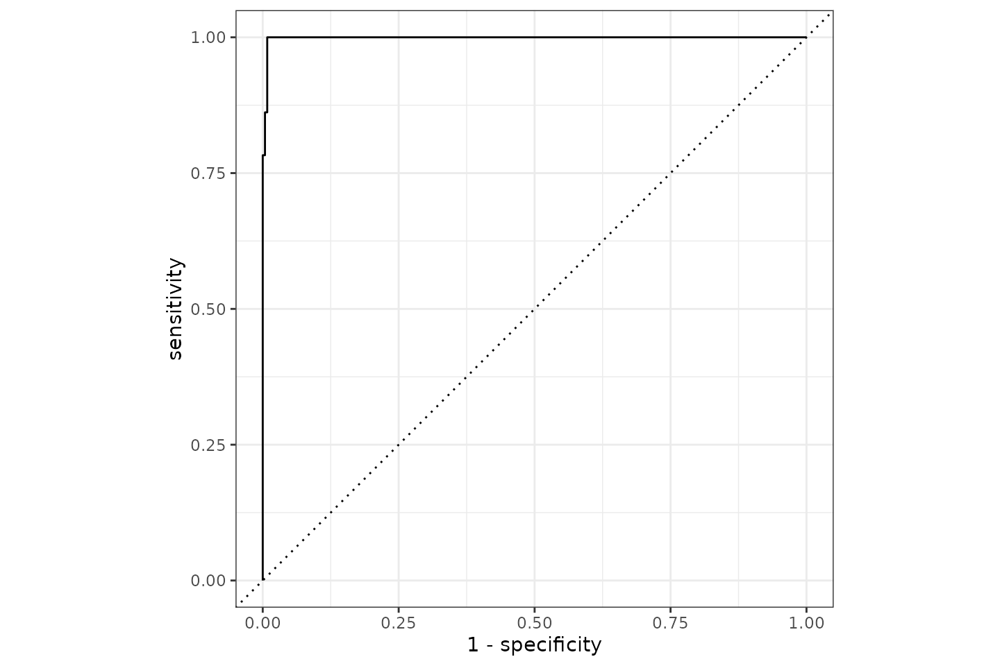
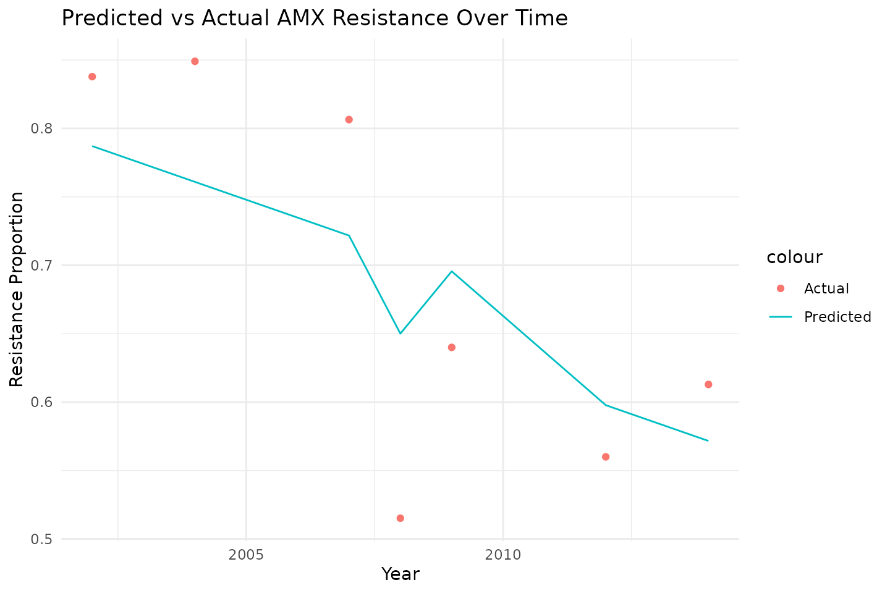
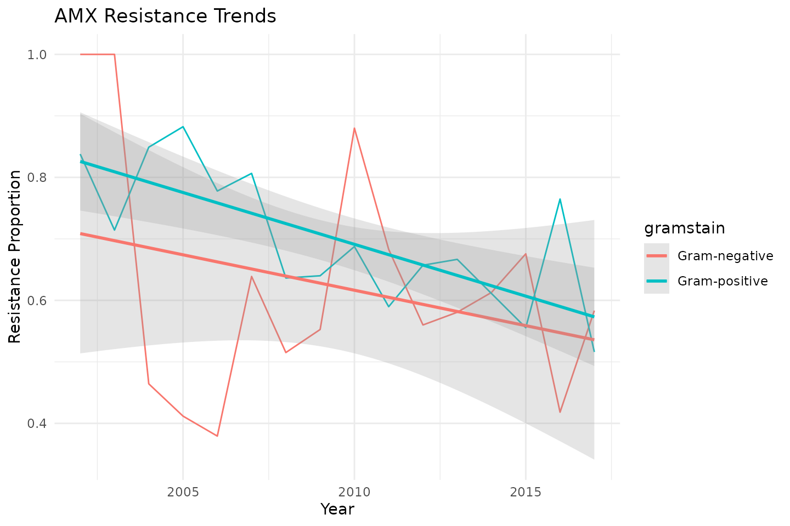

# AMR with tidymodels

> This page was almost entirely written by our [AMR for R
> Assistant](https://chat.amr-for-r.org), a ChatGPT manually-trained
> model able to answer any question about the `AMR` package.

Antimicrobial resistance (AMR) is a global health crisis, and
understanding resistance patterns is crucial for managing effective
treatments. The `AMR` R package provides robust tools for analysing AMR
data, including convenient antimicrobial selector functions like
[`aminoglycosides()`](https://amr-for-r.org/reference/antimicrobial_selectors.md)
and
[`betalactams()`](https://amr-for-r.org/reference/antimicrobial_selectors.md).

In this post, we will explore how to use the `tidymodels` framework to
predict resistance patterns in the `example_isolates` dataset in two
examples.

This post contains the following examples:

1.  Using Antimicrobial Selectors
2.  Predicting ESBL Presence Using Raw MICs
3.  Predicting AMR Over Time

## Example 1: Using Antimicrobial Selectors

By leveraging the power of `tidymodels` and the `AMR` package, we’ll
build a reproducible machine learning workflow to predict the Gramstain
of the microorganism to two important antibiotic classes:
aminoglycosides and beta-lactams.

### **Objective**

Our goal is to build a predictive model using the `tidymodels` framework
to determine the Gramstain of the microorganism based on microbial data.
We will:

1.  Preprocess data using the selector functions
    [`aminoglycosides()`](https://amr-for-r.org/reference/antimicrobial_selectors.md)
    and
    [`betalactams()`](https://amr-for-r.org/reference/antimicrobial_selectors.md).
2.  Define a logistic regression model for prediction.
3.  Use a structured `tidymodels` workflow to preprocess, train, and
    evaluate the model.

### **Data Preparation**

We begin by loading the required libraries and preparing the
`example_isolates` dataset from the `AMR` package.

``` r
# Load required libraries
library(AMR)          # For AMR data analysis
library(tidymodels)   # For machine learning workflows, and data manipulation (dplyr, tidyr, ...)
```

Prepare the data:

``` r
# Your data could look like this:
example_isolates
#> # A tibble: 2,000 × 46
#>    date       patient   age gender ward     mo           PEN   OXA   FLC   AMX  
#>    <date>     <chr>   <dbl> <chr>  <chr>    <mo>         <sir> <sir> <sir> <sir>
#>  1 2002-01-02 A77334     65 F      Clinical B_ESCHR_COLI   R     NA    NA    NA 
#>  2 2002-01-03 A77334     65 F      Clinical B_ESCHR_COLI   R     NA    NA    NA 
#>  3 2002-01-07 067927     45 F      ICU      B_STPHY_EPDR   R     NA    R     NA 
#>  4 2002-01-07 067927     45 F      ICU      B_STPHY_EPDR   R     NA    R     NA 
#>  5 2002-01-13 067927     45 F      ICU      B_STPHY_EPDR   R     NA    R     NA 
#>  6 2002-01-13 067927     45 F      ICU      B_STPHY_EPDR   R     NA    R     NA 
#>  7 2002-01-14 462729     78 M      Clinical B_STPHY_AURS   R     NA    S     R  
#>  8 2002-01-14 462729     78 M      Clinical B_STPHY_AURS   R     NA    S     R  
#>  9 2002-01-16 067927     45 F      ICU      B_STPHY_EPDR   R     NA    R     NA 
#> 10 2002-01-17 858515     79 F      ICU      B_STPHY_EPDR   R     NA    S     NA 
#> # ℹ 1,990 more rows
#> # ℹ 36 more variables: AMC <sir>, AMP <sir>, TZP <sir>, CZO <sir>, FEP <sir>,
#> #   CXM <sir>, FOX <sir>, CTX <sir>, CAZ <sir>, CRO <sir>, GEN <sir>,
#> #   TOB <sir>, AMK <sir>, KAN <sir>, TMP <sir>, SXT <sir>, NIT <sir>,
#> #   FOS <sir>, LNZ <sir>, CIP <sir>, MFX <sir>, VAN <sir>, TEC <sir>,
#> #   TCY <sir>, TGC <sir>, DOX <sir>, ERY <sir>, CLI <sir>, AZM <sir>,
#> #   IPM <sir>, MEM <sir>, MTR <sir>, CHL <sir>, COL <sir>, MUP <sir>, …

# Select relevant columns for prediction
data <- example_isolates %>%
  # select AB results dynamically
  select(mo, aminoglycosides(), betalactams()) %>%
  # replace NAs with NI (not-interpretable)
   mutate(across(where(is.sir),
                 ~replace_na(.x, "NI")),
          # make factors of SIR columns
          across(where(is.sir),
                 as.integer),
          # get Gramstain of microorganisms
          mo = as.factor(mo_gramstain(mo))) %>%
  # drop NAs - the ones without a Gramstain (fungi, etc.)
  drop_na()
#> ℹ For `aminoglycosides()` using columns 'GEN' (gentamicin), 'TOB'
#>   (tobramycin), 'AMK' (amikacin), and 'KAN' (kanamycin)
#> ℹ For `betalactams()` using columns 'PEN' (benzylpenicillin), 'OXA'
#>   (oxacillin), 'FLC' (flucloxacillin), 'AMX' (amoxicillin), 'AMC'
#>   (amoxicillin/clavulanic acid), 'AMP' (ampicillin), 'TZP'
#>   (piperacillin/tazobactam), 'CZO' (cefazolin), 'FEP' (cefepime), 'CXM'
#>   (cefuroxime), 'FOX' (cefoxitin), 'CTX' (cefotaxime), 'CAZ' (ceftazidime),
#>   'CRO' (ceftriaxone), 'IPM' (imipenem), and 'MEM' (meropenem)
```

**Explanation:**

- [`aminoglycosides()`](https://amr-for-r.org/reference/antimicrobial_selectors.md)
  and
  [`betalactams()`](https://amr-for-r.org/reference/antimicrobial_selectors.md)
  dynamically select columns for antimicrobials in these classes.
- `drop_na()` ensures the model receives complete cases for training.

### **Defining the Workflow**

We now define the `tidymodels` workflow, which consists of three steps:
preprocessing, model specification, and fitting.

#### 1. Preprocessing with a Recipe

We create a recipe to preprocess the data for modelling.

``` r
# Define the recipe for data preprocessing
resistance_recipe <- recipe(mo ~ ., data = data) %>%
  step_corr(c(aminoglycosides(), betalactams()), threshold = 0.9)
resistance_recipe
#> 
#> ── Recipe ──────────────────────────────────────────────────────────────────────
#> 
#> ── Inputs
#> Number of variables by role
#> outcome:    1
#> predictor: 20
#> 
#> ── Operations
#> • Correlation filter on: c(aminoglycosides(), betalactams())
```

For a recipe that includes at least one preprocessing operation, like we
have with `step_corr()`, the necessary parameters can be estimated from
a training set using `prep()`:

``` r
prep(resistance_recipe)
#> ℹ For `aminoglycosides()` using columns 'GEN' (gentamicin), 'TOB'
#>   (tobramycin), 'AMK' (amikacin), and 'KAN' (kanamycin)
#> ℹ For `betalactams()` using columns 'PEN' (benzylpenicillin), 'OXA'
#>   (oxacillin), 'FLC' (flucloxacillin), 'AMX' (amoxicillin), 'AMC'
#>   (amoxicillin/clavulanic acid), 'AMP' (ampicillin), 'TZP'
#>   (piperacillin/tazobactam), 'CZO' (cefazolin), 'FEP' (cefepime), 'CXM'
#>   (cefuroxime), 'FOX' (cefoxitin), 'CTX' (cefotaxime), 'CAZ' (ceftazidime),
#>   'CRO' (ceftriaxone), 'IPM' (imipenem), and 'MEM' (meropenem)
#> 
#> ── Recipe ──────────────────────────────────────────────────────────────────────
#> 
#> ── Inputs
#> Number of variables by role
#> outcome:    1
#> predictor: 20
#> 
#> ── Training information
#> Training data contained 1968 data points and no incomplete rows.
#> 
#> ── Operations
#> • Correlation filter on: AMX CTX | Trained
```

**Explanation:**

- `recipe(mo ~ ., data = data)` will take the `mo` column as outcome and
  all other columns as predictors.
- `step_corr()` removes predictors (i.e., antibiotic columns) that have
  a higher correlation than 90%.

Notice how the recipe contains just the antimicrobial selector
functions - no need to define the columns specifically. In the
preparation (retrieved with `prep()`) we can see that the columns or
variables ‘AMX’ and ‘CTX’ were removed as they correlate too much with
existing, other variables.

#### 2. Specifying the Model

We define a logistic regression model since resistance prediction is a
binary classification task.

``` r
# Specify a logistic regression model
logistic_model <- logistic_reg() %>%
  set_engine("glm") # Use the Generalised Linear Model engine
logistic_model
#> Logistic Regression Model Specification (classification)
#> 
#> Computational engine: glm
```

**Explanation:**

- `logistic_reg()` sets up a logistic regression model.
- `set_engine("glm")` specifies the use of R’s built-in GLM engine.

#### 3. Building the Workflow

We bundle the recipe and model together into a `workflow`, which
organises the entire modelling process.

``` r
# Combine the recipe and model into a workflow
resistance_workflow <- workflow() %>%
  add_recipe(resistance_recipe) %>% # Add the preprocessing recipe
  add_model(logistic_model) # Add the logistic regression model
resistance_workflow
#> ══ Workflow ════════════════════════════════════════════════════════════════════
#> Preprocessor: Recipe
#> Model: logistic_reg()
#> 
#> ── Preprocessor ────────────────────────────────────────────────────────────────
#> 1 Recipe Step
#> 
#> • step_corr()
#> 
#> ── Model ───────────────────────────────────────────────────────────────────────
#> Logistic Regression Model Specification (classification)
#> 
#> Computational engine: glm
```

### **Training and Evaluating the Model**

To train the model, we split the data into training and testing sets.
Then, we fit the workflow on the training set and evaluate its
performance.

``` r
# Split data into training and testing sets
set.seed(123) # For reproducibility
data_split <- initial_split(data, prop = 0.8) # 80% training, 20% testing
training_data <- training(data_split) # Training set
testing_data <- testing(data_split)   # Testing set

# Fit the workflow to the training data
fitted_workflow <- resistance_workflow %>%
  fit(training_data) # Train the model
```

**Explanation:**

- `initial_split()` splits the data into training and testing sets.
- `fit()` trains the workflow on the training set.

Notice how in `fit()`, the antimicrobial selector functions are
internally called again. For training, these functions are called since
they are stored in the recipe.

Next, we evaluate the model on the testing data.

``` r
# Make predictions on the testing set
predictions <- fitted_workflow %>%
  predict(testing_data)                # Generate predictions
probabilities <- fitted_workflow %>%
  predict(testing_data, type = "prob") # Generate probabilities

predictions <- predictions %>%
  bind_cols(probabilities) %>%
  bind_cols(testing_data) # Combine with true labels

predictions
#> # A tibble: 394 × 24
#>    .pred_class   `.pred_Gram-negative` `.pred_Gram-positive` mo        GEN   TOB
#>    <fct>                         <dbl>                 <dbl> <fct>   <int> <int>
#>  1 Gram-positive              1.07e- 1             8.93 e- 1 Gram-p…     5     5
#>  2 Gram-positive              3.17e- 8             1.000e+ 0 Gram-p…     5     1
#>  3 Gram-negative              9.99e- 1             1.42 e- 3 Gram-n…     5     5
#>  4 Gram-positive              2.22e-16             1    e+ 0 Gram-p…     5     5
#>  5 Gram-negative              9.46e- 1             5.42 e- 2 Gram-n…     5     5
#>  6 Gram-positive              1.07e- 1             8.93 e- 1 Gram-p…     5     5
#>  7 Gram-positive              2.22e-16             1    e+ 0 Gram-p…     1     5
#>  8 Gram-positive              2.22e-16             1    e+ 0 Gram-p…     4     4
#>  9 Gram-negative              1   e+ 0             2.22 e-16 Gram-n…     1     1
#> 10 Gram-positive              6.05e-11             1.000e+ 0 Gram-p…     4     4
#> # ℹ 384 more rows
#> # ℹ 18 more variables: AMK <int>, KAN <int>, PEN <int>, OXA <int>, FLC <int>,
#> #   AMX <int>, AMC <int>, AMP <int>, TZP <int>, CZO <int>, FEP <int>,
#> #   CXM <int>, FOX <int>, CTX <int>, CAZ <int>, CRO <int>, IPM <int>, MEM <int>

# Evaluate model performance
metrics <- predictions %>%
  metrics(truth = mo, estimate = .pred_class) # Calculate performance metrics

metrics
#> # A tibble: 2 × 3
#>   .metric  .estimator .estimate
#>   <chr>    <chr>          <dbl>
#> 1 accuracy binary         0.995
#> 2 kap      binary         0.989


# To assess some other model properties, you can make our own `metrics()` function
our_metrics <- metric_set(accuracy, kap, ppv, npv) # add Positive Predictive Value and Negative Predictive Value
metrics2 <- predictions %>%
  our_metrics(truth = mo, estimate = .pred_class) # run again on our `our_metrics()` function

metrics2
#> # A tibble: 4 × 3
#>   .metric  .estimator .estimate
#>   <chr>    <chr>          <dbl>
#> 1 accuracy binary         0.995
#> 2 kap      binary         0.989
#> 3 ppv      binary         0.987
#> 4 npv      binary         1
```

**Explanation:**

- [`predict()`](https://rdrr.io/r/stats/predict.html) generates
  predictions on the testing set.
- `metrics()` computes evaluation metrics like accuracy and kappa.

It appears we can predict the Gram stain with a 99.5% accuracy based on
AMR results of only aminoglycosides and beta-lactam antibiotics. The ROC
curve looks like this:

``` r
predictions %>%
  roc_curve(mo, `.pred_Gram-negative`) %>%
  autoplot()
```



### **Conclusion**

In this example, we demonstrated how to build a machine learning
pipeline with the `tidymodels` framework and the `AMR` package. By
combining selector functions like
[`aminoglycosides()`](https://amr-for-r.org/reference/antimicrobial_selectors.md)
and
[`betalactams()`](https://amr-for-r.org/reference/antimicrobial_selectors.md)
with `tidymodels`, we efficiently prepared data, trained a model, and
evaluated its performance.

This workflow is extensible to other antimicrobial classes and
resistance patterns, empowering users to analyse AMR data systematically
and reproducibly.

------------------------------------------------------------------------

## Example 2: Predicting ESBL Presence Using Raw MICs

In this second example, we demonstrate how to use `<mic>` columns
directly in `tidymodels` workflows using AMR-specific recipe steps. This
includes a transformation to `log2` scale using
[`step_mic_log2()`](https://amr-for-r.org/reference/amr-tidymodels.md),
which prepares MIC values for use in classification models.

This approach and idea formed the basis for the publication [DOI:
10.3389/fmicb.2025.1582703](https://doi.org/10.3389/fmicb.2025.1582703)
to model the presence of extended-spectrum beta-lactamases (ESBL) based
on MIC values.

### **Objective**

Our goal is to:

1.  Use raw MIC values to predict whether a bacterial isolate produces
    ESBL.
2.  Apply AMR-aware preprocessing in a `tidymodels` recipe.
3.  Train a classification model and evaluate its predictive
    performance.

### **Data Preparation**

We use the `esbl_isolates` dataset that comes with the AMR package.

``` r
# Load required libraries
library(AMR)
library(tidymodels)

# View the esbl_isolates data set
esbl_isolates
#> # A tibble: 500 × 19
#>    esbl  genus   AMC   AMP   TZP   CXM   FOX   CTX   CAZ   GEN   TOB   TMP   SXT
#>    <lgl> <chr> <mic> <mic> <mic> <mic> <mic> <mic> <mic> <mic> <mic> <mic> <mic>
#>  1 FALSE Esch…    32    32     4    64    64  8.00  8.00     1     1  16.0    20
#>  2 FALSE Esch…    32    32     4    64    64  4.00  8.00     1     1  16.0   320
#>  3 FALSE Esch…     4     2    64     8     4  8.00  0.12    16    16   0.5    20
#>  4 FALSE Kleb…    32    32    16    64    64  8.00  8.00     1     1   0.5    20
#>  5 FALSE Esch…    32    32     4     4     4  0.25  2.00     1     1  16.0   320
#>  6 FALSE Citr…    32    32    16    64    64 64.00 32.00     1     1   0.5    20
#>  7 FALSE Morg…    32    32     4    64    64 16.00  2.00     1     1   0.5    20
#>  8 FALSE Prot…    16    32     4     1     4  8.00  0.12     1     1  16.0   320
#>  9 FALSE Ente…    32    32     8    64    64 32.00  4.00     1     1   0.5    20
#> 10 FALSE Citr…    32    32    32    64    64  8.00 64.00     1     1  16.0   320
#> # ℹ 490 more rows
#> # ℹ 6 more variables: NIT <mic>, FOS <mic>, CIP <mic>, IPM <mic>, MEM <mic>,
#> #   COL <mic>

# Prepare a binary outcome and convert to ordered factor
data <- esbl_isolates %>%
  mutate(esbl = factor(esbl, levels = c(FALSE, TRUE), ordered = TRUE))
```

**Explanation:**

- `esbl_isolates`: Contains MIC test results and ESBL status for each
  isolate.
- `mutate(esbl = ...)`: Converts the target column to an ordered factor
  for classification.

### **Defining the Workflow**

#### 1. Preprocessing with a Recipe

We use our
[`step_mic_log2()`](https://amr-for-r.org/reference/amr-tidymodels.md)
function to log2-transform MIC values, ensuring that MICs are numeric
and properly scaled. All MIC predictors can easily and agnostically
selected using the new
[`all_mic_predictors()`](https://amr-for-r.org/reference/amr-tidymodels.md):

``` r
# Split into training and testing sets
set.seed(123)
split <- initial_split(data)
training_data <- training(split)
testing_data <- testing(split)

# Define the recipe
mic_recipe <- recipe(esbl ~ ., data = training_data) %>%
  remove_role(genus, old_role = "predictor") %>%  # Remove non-informative variable
  step_mic_log2(all_mic_predictors())             # Log2 transform all MIC predictors

prep(mic_recipe)
#> 
#> ── Recipe ──────────────────────────────────────────────────────────────────────
#> 
#> ── Inputs
#> Number of variables by role
#> outcome:          1
#> predictor:       17
#> undeclared role:  1
#> 
#> ── Training information
#> Training data contained 375 data points and no incomplete rows.
#> 
#> ── Operations
#> • Log2 transformation of MIC columns: AMC, AMP, TZP, CXM, FOX, ... | Trained
```

**Explanation:**

- `remove_role()`: Removes irrelevant variables like genus.
- [`step_mic_log2()`](https://amr-for-r.org/reference/amr-tidymodels.md):
  Applies `log2(as.numeric(...))` to all MIC predictors in one go.
- `prep()`: Finalises the recipe based on training data.

#### 2. Specifying the Model

We use a simple logistic regression to model ESBL presence, though
recent models such as xgboost ([link to `parsnip`
manual](https://parsnip.tidymodels.org/reference/details_boost_tree_xgboost.html))
could be much more precise.

``` r
# Define the model
model <- logistic_reg(mode = "classification") %>%
  set_engine("glm")

model
#> Logistic Regression Model Specification (classification)
#> 
#> Computational engine: glm
```

**Explanation:**

- `logistic_reg()`: Specifies a binary classification model.
- `set_engine("glm")`: Uses the base R GLM engine.

#### 3. Building the Workflow

``` r
# Create workflow
workflow_model <- workflow() %>%
  add_recipe(mic_recipe) %>%
  add_model(model)

workflow_model
#> ══ Workflow ════════════════════════════════════════════════════════════════════
#> Preprocessor: Recipe
#> Model: logistic_reg()
#> 
#> ── Preprocessor ────────────────────────────────────────────────────────────────
#> 1 Recipe Step
#> 
#> • step_mic_log2()
#> 
#> ── Model ───────────────────────────────────────────────────────────────────────
#> Logistic Regression Model Specification (classification)
#> 
#> Computational engine: glm
```

### **Training and Evaluating the Model**

``` r
# Fit the model
fitted <- fit(workflow_model, training_data)

# Generate predictions
predictions <- predict(fitted, testing_data) %>%
  bind_cols(predict(fitted, testing_data, type = "prob")) %>% # add probabilities
  bind_cols(testing_data)

# Evaluate model performance
our_metrics <- metric_set(accuracy, recall, precision, sensitivity, specificity, ppv, npv)
metrics <- our_metrics(predictions, truth = esbl, estimate = .pred_class)

metrics
#> # A tibble: 7 × 3
#>   .metric     .estimator .estimate
#>   <chr>       <chr>          <dbl>
#> 1 accuracy    binary         0.92 
#> 2 recall      binary         0.921
#> 3 precision   binary         0.921
#> 4 sensitivity binary         0.921
#> 5 specificity binary         0.919
#> 6 ppv         binary         0.921
#> 7 npv         binary         0.919
```

**Explanation:**

- `fit()`: Trains the model on the processed training data.
- [`predict()`](https://rdrr.io/r/stats/predict.html): Produces
  predictions for unseen test data.
- `metric_set()`: Allows evaluating multiple classification metrics.
  This will make `our_metrics` to become a function that we can use to
  check the predictions with.

It appears we can predict ESBL gene presence with a positive predictive
value (PPV) of 92.1% and a negative predictive value (NPV) of 91.9%
using a simplistic logistic regression model.

### **Visualising Predictions**

We can visualise predictions by comparing predicted and actual ESBL
status.

``` r
library(ggplot2)

ggplot(predictions, aes(x = esbl, fill = .pred_class)) +
  geom_bar(position = "stack") +
  labs(title = "Predicted vs Actual ESBL Status",
       x = "Actual ESBL",
       y = "Count") +
  theme_minimal()
```



And plot the certainties too - how certain were the actual predictions?

``` r
predictions %>%
  mutate(certainty = ifelse(.pred_class == "FALSE",
                            .pred_FALSE,
                            .pred_TRUE),
         correct = ifelse(esbl == .pred_class, "Right", "Wrong")) %>%
  ggplot(aes(x = seq_len(nrow(predictions)),
             y = certainty,
             colour = correct)) +
  scale_colour_manual(values = c(Right = "green3", Wrong = "red2"),
                      name = "Correct?") +
  geom_point() +
  scale_y_continuous(labels = function(x) paste0(x * 100, "%"),
                     limits = c(0.5, 1)) +
  theme_minimal()
```



### **Conclusion**

In this example, we showcased how the new `AMR`-specific recipe steps
simplify working with `<mic>` columns in `tidymodels`. The
[`step_mic_log2()`](https://amr-for-r.org/reference/amr-tidymodels.md)
transformation converts MICs (with or without operators) to
log2-transformed numerics, improving compatibility with classification
models.

This pipeline enables realistic, reproducible, and interpretable
modelling of antimicrobial resistance data.

------------------------------------------------------------------------

## Example 3: Predicting AMR Over Time

In this third example, we aim to predict antimicrobial resistance (AMR)
trends over time using `tidymodels`. We will model resistance to three
antibiotics (amoxicillin `AMX`, amoxicillin-clavulanic acid `AMC`, and
ciprofloxacin `CIP`), based on historical data grouped by year and
hospital ward.

### **Objective**

Our goal is to:

1.  Prepare the dataset by aggregating resistance data over time.
2.  Define a regression model to predict AMR trends.
3.  Use `tidymodels` to preprocess, train, and evaluate the model.

### **Data Preparation**

We start by transforming the `example_isolates` dataset into a
structured time-series format.

``` r
# Load required libraries
library(AMR)
library(tidymodels)

# Transform dataset
data_time <- example_isolates %>%
  top_n_microorganisms(n = 10) %>% # Filter on the top #10 species
  mutate(year = as.integer(format(date, "%Y")),  # Extract year from date
         gramstain = mo_gramstain(mo)) %>% # Get taxonomic names
  group_by(year, gramstain) %>%
  summarise(across(c(AMX, AMC, CIP), 
                   function(x) resistance(x, minimum = 0),
                   .names = "res_{.col}"), 
            .groups = "drop") %>% 
  filter(!is.na(res_AMX) & !is.na(res_AMC) & !is.na(res_CIP)) # Drop missing values
#> ℹ Using column 'mo' as input for `col_mo`.

data_time
#> # A tibble: 32 × 5
#>     year gramstain     res_AMX res_AMC res_CIP
#>    <int> <chr>           <dbl>   <dbl>   <dbl>
#>  1  2002 Gram-negative   1      0.105   0.0606
#>  2  2002 Gram-positive   0.838  0.182   0.162 
#>  3  2003 Gram-negative   1      0.0714  0     
#>  4  2003 Gram-positive   0.714  0.244   0.154 
#>  5  2004 Gram-negative   0.464  0.0938  0     
#>  6  2004 Gram-positive   0.849  0.299   0.244 
#>  7  2005 Gram-negative   0.412  0.132   0.0588
#>  8  2005 Gram-positive   0.882  0.382   0.154 
#>  9  2006 Gram-negative   0.379  0       0.1   
#> 10  2006 Gram-positive   0.778  0.333   0.353 
#> # ℹ 22 more rows
```

**Explanation:**

- `mo_name(mo)`: Converts microbial codes into proper species names.
- [`resistance()`](https://amr-for-r.org/reference/proportion.md):
  Converts AMR results into numeric values (proportion of resistant
  isolates).
- `group_by(year, ward, species)`: Aggregates resistance rates by year
  and ward.

### **Defining the Workflow**

We now define the modelling workflow, which consists of a preprocessing
step, a model specification, and the fitting process.

#### 1. Preprocessing with a Recipe

``` r
# Define the recipe
resistance_recipe_time <- recipe(res_AMX ~ year + gramstain, data = data_time) %>%
  step_dummy(gramstain, one_hot = TRUE) %>%  # Convert categorical to numerical
  step_normalize(year) %>%  # Normalise year for better model performance
  step_nzv(all_predictors())  # Remove near-zero variance predictors

resistance_recipe_time
#> 
#> ── Recipe ──────────────────────────────────────────────────────────────────────
#> 
#> ── Inputs
#> Number of variables by role
#> outcome:   1
#> predictor: 2
#> 
#> ── Operations
#> • Dummy variables from: gramstain
#> • Centering and scaling for: year
#> • Sparse, unbalanced variable filter on: all_predictors()
```

**Explanation:**

- `step_dummy()`: Encodes categorical variables (`ward`, `species`) as
  numerical indicators.
- `step_normalize()`: Normalises the `year` variable.
- `step_nzv()`: Removes near-zero variance predictors.

#### 2. Specifying the Model

We use a linear regression model to predict resistance trends.

``` r
# Define the linear regression model
lm_model <- linear_reg() %>%
  set_engine("lm") # Use linear regression

lm_model
#> Linear Regression Model Specification (regression)
#> 
#> Computational engine: lm
```

**Explanation:**

- `linear_reg()`: Defines a linear regression model.
- `set_engine("lm")`: Uses R’s built-in linear regression engine.

#### 3. Building the Workflow

We combine the preprocessing recipe and model into a workflow.

``` r
# Create workflow
resistance_workflow_time <- workflow() %>%
  add_recipe(resistance_recipe_time) %>%
  add_model(lm_model)

resistance_workflow_time
#> ══ Workflow ════════════════════════════════════════════════════════════════════
#> Preprocessor: Recipe
#> Model: linear_reg()
#> 
#> ── Preprocessor ────────────────────────────────────────────────────────────────
#> 3 Recipe Steps
#> 
#> • step_dummy()
#> • step_normalize()
#> • step_nzv()
#> 
#> ── Model ───────────────────────────────────────────────────────────────────────
#> Linear Regression Model Specification (regression)
#> 
#> Computational engine: lm
```

### **Training and Evaluating the Model**

We split the data into training and testing sets, fit the model, and
evaluate performance.

``` r
# Split the data
set.seed(123)
data_split_time <- initial_split(data_time, prop = 0.8)
train_time <- training(data_split_time)
test_time <- testing(data_split_time)

# Train the model
fitted_workflow_time <- resistance_workflow_time %>%
  fit(train_time)

# Make predictions
predictions_time <- fitted_workflow_time %>%
  predict(test_time) %>%
  bind_cols(test_time)

# Evaluate model
metrics_time <- predictions_time %>%
  metrics(truth = res_AMX, estimate = .pred)

metrics_time
#> # A tibble: 3 × 3
#>   .metric .estimator .estimate
#>   <chr>   <chr>          <dbl>
#> 1 rmse    standard      0.0774
#> 2 rsq     standard      0.711 
#> 3 mae     standard      0.0704
```

**Explanation:**

- `initial_split()`: Splits data into training and testing sets.
- `fit()`: Trains the workflow.
- [`predict()`](https://rdrr.io/r/stats/predict.html): Generates
  resistance predictions.
- `metrics()`: Evaluates model performance.

### **Visualising Predictions**

We plot resistance trends over time for amoxicillin.

``` r
library(ggplot2)

# Plot actual vs predicted resistance over time
ggplot(predictions_time, aes(x = year)) +
  geom_point(aes(y = res_AMX, color = "Actual")) +
  geom_line(aes(y = .pred, color = "Predicted")) +
  labs(title = "Predicted vs Actual AMX Resistance Over Time",
       x = "Year",
       y = "Resistance Proportion") +
  theme_minimal()
```


Additionally, we can visualise resistance trends in `ggplot2` and
directly add linear models there:

``` r
ggplot(data_time, aes(x = year, y = res_AMX, color = gramstain)) +
  geom_line() +
  labs(title = "AMX Resistance Trends",
       x = "Year",
       y = "Resistance Proportion") +
  # add a linear model directly in ggplot2:
  geom_smooth(method = "lm",
              formula = y ~ x,
              alpha = 0.25) +
  theme_minimal()
```


### **Conclusion**

In this example, we demonstrated how to analyze AMR trends over time
using `tidymodels`. By aggregating resistance rates by year and hospital
ward, we built a predictive model to track changes in resistance to
amoxicillin (`AMX`), amoxicillin-clavulanic acid (`AMC`), and
ciprofloxacin (`CIP`).

This method can be extended to other antibiotics and resistance
patterns, providing valuable insights into AMR dynamics in healthcare
settings.
