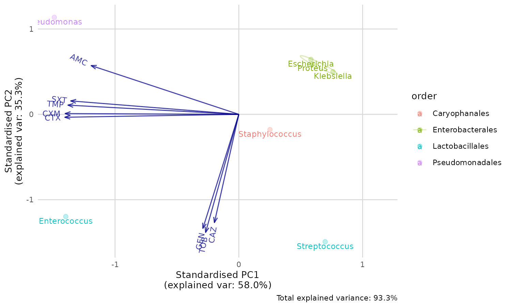

# Conduct principal component analysis (PCA) for AMR

**NOTE: This page will be updated soon, as the pca() function is
currently being developed.**

## Introduction

## Transforming

For PCA, we need to transform our AMR data first. This is what the
`example_isolates` data set in this package looks like:

``` r
library(AMR)
library(dplyr)
glimpse(example_isolates)
#> Rows: 2,000
#> Columns: 46
#> $ date    <date> 2002-01-02, 2002-01-03, 2002-01-07, 2002-01-07, 2002-01-13, 2…
#> $ patient <chr> "A77334", "A77334", "067927", "067927", "067927", "067927", "4…
#> $ age     <dbl> 65, 65, 45, 45, 45, 45, 78, 78, 45, 79, 67, 67, 71, 71, 75, 50…
#> $ gender  <chr> "F", "F", "F", "F", "F", "F", "M", "M", "F", "F", "M", "M", "M…
#> $ ward    <chr> "Clinical", "Clinical", "ICU", "ICU", "ICU", "ICU", "Clinical"…
#> $ mo      <mo> "B_ESCHR_COLI", "B_ESCHR_COLI", "B_STPHY_EPDR", "B_STPHY_EPDR",…
#> $ PEN     <sir> R, R, R, R, R, R, R, R, R, R, R, R, R, R, R, R, R, R, R, R, S,…
#> $ OXA     <sir> NA, NA, NA, NA, NA, NA, NA, NA, NA, NA, NA, NA, NA, NA, NA, NA…
#> $ FLC     <sir> NA, NA, R, R, R, R, S, S, R, S, S, S, NA, NA, NA, NA, NA, R, R…
#> $ AMX     <sir> NA, NA, NA, NA, NA, NA, R, R, NA, NA, NA, NA, NA, NA, R, NA, N…
#> $ AMC     <sir> I, I, NA, NA, NA, NA, S, S, NA, NA, S, S, I, I, R, I, I, NA, N…
#> $ AMP     <sir> NA, NA, NA, NA, NA, NA, R, R, NA, NA, NA, NA, NA, NA, R, NA, N…
#> $ TZP     <sir> NA, NA, NA, NA, NA, NA, NA, NA, NA, NA, NA, NA, NA, NA, NA, NA…
#> $ CZO     <sir> NA, NA, NA, NA, NA, NA, NA, NA, NA, NA, NA, NA, NA, NA, R, NA,…
#> $ FEP     <sir> NA, NA, NA, NA, NA, NA, NA, NA, NA, NA, NA, NA, NA, NA, NA, NA…
#> $ CXM     <sir> I, I, R, R, R, R, S, S, R, S, S, S, S, S, NA, S, S, R, R, S, S…
#> $ FOX     <sir> NA, NA, NA, NA, NA, NA, NA, NA, NA, NA, NA, NA, NA, NA, R, NA,…
#> $ CTX     <sir> NA, NA, NA, NA, NA, NA, NA, NA, NA, NA, NA, NA, S, S, NA, S, S…
#> $ CAZ     <sir> NA, NA, R, R, R, R, R, R, R, R, R, R, NA, NA, NA, S, S, R, R, …
#> $ CRO     <sir> NA, NA, NA, NA, NA, NA, NA, NA, NA, NA, NA, NA, S, S, NA, S, S…
#> $ GEN     <sir> NA, NA, NA, NA, NA, NA, NA, NA, NA, NA, NA, NA, NA, NA, NA, NA…
#> $ TOB     <sir> NA, NA, NA, NA, NA, NA, S, S, NA, NA, NA, NA, S, S, NA, NA, NA…
#> $ AMK     <sir> NA, NA, NA, NA, NA, NA, NA, NA, NA, NA, NA, NA, NA, NA, NA, NA…
#> $ KAN     <sir> NA, NA, NA, NA, NA, NA, NA, NA, NA, NA, NA, NA, NA, NA, NA, NA…
#> $ TMP     <sir> R, R, S, S, R, R, R, R, S, S, NA, NA, S, S, S, S, S, R, R, R, …
#> $ SXT     <sir> R, R, S, S, NA, NA, NA, NA, S, S, NA, NA, S, S, S, S, S, NA, N…
#> $ NIT     <sir> NA, NA, NA, NA, NA, NA, NA, NA, NA, NA, NA, NA, NA, NA, NA, R,…
#> $ FOS     <sir> NA, NA, NA, NA, NA, NA, NA, NA, NA, NA, NA, NA, NA, NA, NA, NA…
#> $ LNZ     <sir> R, R, NA, NA, NA, NA, NA, NA, NA, NA, NA, NA, R, R, R, R, R, N…
#> $ CIP     <sir> NA, NA, NA, NA, NA, NA, NA, NA, S, S, NA, NA, NA, NA, NA, S, S…
#> $ MFX     <sir> NA, NA, NA, NA, NA, NA, NA, NA, NA, NA, NA, NA, NA, NA, NA, NA…
#> $ VAN     <sir> R, R, S, S, S, S, S, S, S, S, NA, NA, R, R, R, R, R, S, S, S, …
#> $ TEC     <sir> R, R, NA, NA, NA, NA, NA, NA, NA, NA, NA, NA, R, R, R, R, R, N…
#> $ TCY     <sir> R, R, S, S, S, S, S, S, S, I, S, S, NA, NA, I, R, R, S, I, R, …
#> $ TGC     <sir> NA, NA, S, S, S, S, S, S, S, NA, S, S, NA, NA, NA, R, R, S, NA…
#> $ DOX     <sir> NA, NA, S, S, S, S, S, S, S, NA, S, S, NA, NA, NA, R, R, S, NA…
#> $ ERY     <sir> R, R, R, R, R, R, S, S, R, S, S, S, R, R, R, R, R, R, R, R, S,…
#> $ CLI     <sir> R, R, NA, NA, NA, R, NA, NA, NA, NA, NA, NA, R, R, R, R, R, NA…
#> $ AZM     <sir> R, R, R, R, R, R, S, S, R, S, S, S, R, R, R, R, R, R, R, R, S,…
#> $ IPM     <sir> NA, NA, NA, NA, NA, NA, NA, NA, NA, NA, NA, NA, S, S, NA, S, S…
#> $ MEM     <sir> NA, NA, NA, NA, NA, NA, NA, NA, NA, NA, NA, NA, NA, NA, NA, NA…
#> $ MTR     <sir> NA, NA, NA, NA, NA, NA, NA, NA, NA, NA, NA, NA, NA, NA, NA, NA…
#> $ CHL     <sir> NA, NA, NA, NA, NA, NA, NA, NA, NA, NA, NA, NA, NA, NA, NA, NA…
#> $ COL     <sir> NA, NA, R, R, R, R, R, R, R, R, R, R, NA, NA, NA, R, R, R, R, …
#> $ MUP     <sir> NA, NA, NA, NA, NA, NA, NA, NA, NA, NA, NA, NA, NA, NA, NA, NA…
#> $ RIF     <sir> R, R, NA, NA, NA, NA, NA, NA, NA, NA, NA, NA, R, R, R, R, R, N…
```

Now to transform this to a data set with only resistance percentages per
taxonomic order and genus:

``` r
resistance_data <- example_isolates %>%
  group_by(
    order = mo_order(mo), # group on anything, like order
    genus = mo_genus(mo)
  ) %>% #  and genus as we do here
  summarise_if(is.sir, resistance) %>% # then get resistance of all drugs
  select(
    order, genus, AMC, CXM, CTX,
    CAZ, GEN, TOB, TMP, SXT
  ) # and select only relevant columns

head(resistance_data)
#> # A tibble: 6 × 10
#> # Groups:   order [5]
#>   order             genus          AMC   CXM   CTX   CAZ   GEN   TOB   TMP   SXT
#>   <chr>             <chr>        <dbl> <dbl> <dbl> <dbl> <dbl> <dbl> <dbl> <dbl>
#> 1 (unknown order)   (unknown ge…    NA    NA    NA    NA    NA    NA    NA    NA
#> 2 Actinomycetales   Schaalia        NA    NA    NA    NA    NA    NA    NA    NA
#> 3 Bacteroidales     Bacteroides     NA    NA    NA    NA    NA    NA    NA    NA
#> 4 Campylobacterales Campylobact…    NA    NA    NA    NA    NA    NA    NA    NA
#> 5 Caryophanales     Gemella         NA    NA    NA    NA    NA    NA    NA    NA
#> 6 Caryophanales     Listeria        NA    NA    NA    NA    NA    NA    NA    NA
```

## Perform principal component analysis

The new [`pca()`](https://amr-for-r.org/reference/pca.md) function will
automatically filter on rows that contain numeric values in all selected
variables, so we now only need to do:

``` r
pca_result <- pca(resistance_data)
#> ℹ Columns selected for PCA: "AMC", "CAZ", "CTX", "CXM", "GEN", "SXT",
#>   "TMP", and "TOB". Total observations available: 7.
```

The result can be reviewed with the good old
[`summary()`](https://rdrr.io/r/base/summary.html) function:

``` r
summary(pca_result)
#> Groups (n=4, named as 'order'):
#> [1] "Caryophanales"    "Enterobacterales" "Lactobacillales"  "Pseudomonadales"
#> Importance of components:
#>                           PC1    PC2    PC3     PC4     PC5     PC6       PC7
#> Standard deviation     2.1539 1.6807 0.6138 0.33879 0.20808 0.03140 9.577e-17
#> Proportion of Variance 0.5799 0.3531 0.0471 0.01435 0.00541 0.00012 0.000e+00
#> Cumulative Proportion  0.5799 0.9330 0.9801 0.99446 0.99988 1.00000 1.000e+00
```

    #> Groups (n=4, named as 'order'):
    #> [1] "Caryophanales"    "Enterobacterales" "Lactobacillales"  "Pseudomonadales"

Good news. The first two components explain a total of 93.3% of the
variance (see the PC1 and PC2 values of the *Proportion of Variance*. We
can create a so-called biplot with the base R
[`biplot()`](https://rdrr.io/r/stats/biplot.html) function, to see which
antimicrobial resistance per drug explain the difference per
microorganism.

## Plotting the results

``` r
biplot(pca_result)
```


But we can’t see the explanation of the points. Perhaps this works
better with our new
[`ggplot_pca()`](https://amr-for-r.org/reference/ggplot_pca.md)
function, that automatically adds the right labels and even groups:

``` r
ggplot_pca(pca_result)
```



You can also print an ellipse per group, and edit the appearance:

``` r
ggplot_pca(pca_result, ellipse = TRUE) +
  ggplot2::labs(title = "An AMR/PCA biplot!")
```


