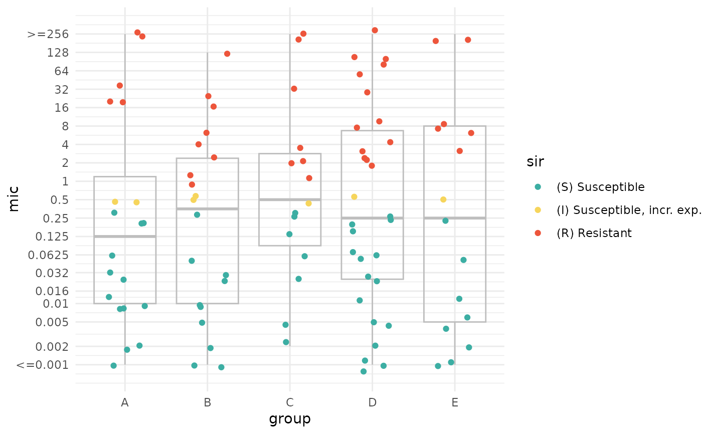

<!-- index.md is generated from index.Rmd; please edit that file. -->

# The `AMR` Package for R <a href="https://amr-for-r.org/"></a>

- Provides an **all-in-one solution** for antimicrobial resistance (AMR)
  data analysis in a One Health approach
- Peer-reviewed, used in over 175 countries, available in 28 languages
- Generates **antibiograms** - traditional, combined, syndromic, and
  even WISCA
- Provides the **full microbiological taxonomy** of ~79 000 distinct
  species and extensive info of ~620 antimicrobial drugs
- Applies **CLSI 2011-2025** and **EUCAST 2011-2025** clinical and
  veterinary breakpoints, and ECOFFs, for MIC and disk zone
  interpretation
- Corrects for duplicate isolates, **calculates** and **predicts** AMR
  per antimicrobial class
- Integrates with **WHONET**, ATC, **EARS-Net**, PubChem, **LOINC**,
  **SNOMED CT**, and **NCBI**
- 100% free of costs and dependencies, highly suitable for places with
  **limited resources**

> Now available for Python too! [Click
> here](./articles/AMR_for_Python.html) to read more.

<div style="display: flex; font-size: 0.8em;">

<p style="text-align:left; width: 50%;">

<small><a href="https://amr-for-r.org/">amr-for-r.org</a></small>
</p>

<p style="text-align:right; width: 50%;">

<small><a href="https://doi.org/10.18637/jss.v104.i03" target="_blank">doi.org/10.18637/jss.v104.i03</a></small>
</p>

</div>

<a href="./reference/clinical_breakpoints.html#response-from-clsi-and-eucast"></a>

------------------------------------------------------------------------

## Introduction

The `AMR` package is a peer-reviewed, [free and open-source](#copyright)
R package with [zero
dependencies](https://en.wikipedia.org/wiki/Dependency_hell) to simplify
the analysis and prediction of Antimicrobial Resistance (AMR) and to
work with microbial and antimicrobial data and properties, by using
evidence-based methods. **Our aim is to provide a standard** for clean
and reproducible AMR data analysis, that can therefore empower
epidemiological analyses to continuously enable surveillance and
treatment evaluation in any setting. We are a team of [many different
researchers](./authors.html) from around the globe to make this a
successful and durable project!

This work was published in the Journal of Statistical Software (Volume
104(3); [DOI
10.18637/jss.v104.i03](https://doi.org/10.18637/jss.v104.i03)) and
formed the basis of two PhD theses ([DOI
10.33612/diss.177417131](https://doi.org/10.33612/diss.177417131) and
[DOI 10.33612/diss.192486375](https://doi.org/10.33612/diss.192486375)).

After installing this package, R knows [**~79 000 distinct microbial
species**](./reference/microorganisms.html) (updated June 2024) and all
[**~620 antimicrobial and antiviral
drugs**](./reference/antimicrobials.html) by name and code (including
ATC, EARS-Net, ASIARS-Net, PubChem, LOINC and SNOMED CT), and knows all
about valid SIR and MIC values. The integral clinical breakpoint
guidelines from CLSI 2011-2025 and EUCAST 2011-2025 are included, even
with epidemiological cut-off (ECOFF) values. It supports and can read
any data format, including WHONET data. This package works on Windows,
macOS and Linux with all versions of R since R-3.0 (April 2013). **It
was designed to work in any setting, including those with very limited
resources**. It was created for both routine data analysis and academic
research at the Faculty of Medical Sciences of the [University of
Groningen](https://www.rug.nl) and the [University Medical Center
Groningen](https://www.umcg.nl).

### Used in over 175 countries, available in 28 languages

<a href="./countries_large.png" target="_blank"></a>

Since its first public release in early 2018, this R package has been
used in almost all countries in the world. Click the map to enlarge and
to see the country names.

With the help of contributors from all corners of the world, the `AMR`
package is available in

English,

Arabic,

Bengali,

Chinese,

Czech,

Danish,

Dutch,

Finnish,

French,

German,

Greek,

Hindi,

Indonesian,

Italian,

Japanese,

Korean,

Norwegian,

Polish,

Portuguese,

Romanian,

Russian,

Spanish,

Swahili,

Swedish,

Turkish,

Ukrainian,

Urdu, and

Vietnamese. Antimicrobial drug (group) names and colloquial
microorganism names are provided in these languages.

## Practical examples

### Filtering and selecting data

One of the most powerful functions of this package, aside from
calculating and plotting AMR, is selecting and filtering based on
antimicrobial columns. This can be done using the so-called
[antimicrobial
selectors](https://amr-for-r.org/reference/antimicrobial_selectors.html),
which work in base R, `dplyr` and `data.table`.

``` r
# AMR works great with dplyr, but it's not required or neccesary
library(AMR)
library(dplyr, warn.conflicts = FALSE)

example_isolates %>%
  mutate(bacteria = mo_fullname()) %>%
  # filtering functions for microorganisms:
  filter(mo_is_gram_negative(),
         mo_is_intrinsic_resistant(ab = "cefotax")) %>%
  # antimicrobial selectors:
  select(bacteria,
         aminoglycosides(),
         carbapenems())
#> ℹ Using column 'mo' as input for `mo_fullname()`
#> ℹ Using column 'mo' as input for `mo_is_gram_negative()`
#> ℹ Using column 'mo' as input for `mo_is_intrinsic_resistant()`
#> ℹ Determining intrinsic resistance based on 'EUCAST Expected Resistant
#>   Phenotypes' v1.2 (2023). This note will be shown once per session.
#> ℹ For `aminoglycosides()` using columns 'GEN' (gentamicin), 'TOB'
#>   (tobramycin), 'AMK' (amikacin), and 'KAN' (kanamycin)
#> ℹ For `carbapenems()` using columns 'IPM' (imipenem) and 'MEM' (meropenem)
#> # A tibble: 35 × 7
#>    bacteria                     GEN   TOB   AMK   KAN   IPM   MEM  
#>    <chr>                        <sir> <sir> <sir> <sir> <sir> <sir>
#>  1 Pseudomonas aeruginosa       I     S     NA    R     S     NA   
#>  2 Pseudomonas aeruginosa       I     S     NA    R     S     NA   
#>  3 Pseudomonas aeruginosa       I     S     NA    R     S     NA   
#>  4 Pseudomonas aeruginosa       S     S     S     R     NA    S    
#>  5 Pseudomonas aeruginosa       S     S     S     R     S     S    
#>  6 Pseudomonas aeruginosa       S     S     S     R     S     S    
#>  7 Stenotrophomonas maltophilia R     R     R     R     R     R    
#>  8 Pseudomonas aeruginosa       S     S     S     R     NA    S    
#>  9 Pseudomonas aeruginosa       S     S     S     R     NA    S    
#> 10 Pseudomonas aeruginosa       S     S     S     R     S     S    
#> # ℹ 25 more rows
```

With only having defined a row filter on Gram-negative bacteria with
intrinsic resistance to cefotaxime (`mo_is_gram_negative()` and
`mo_is_intrinsic_resistant()`) and a column selection on two antibiotic
groups (`aminoglycosides()` and `carbapenems()`), the reference data
about [all microorganisms](./reference/microorganisms.html) and [all
antimicrobials](./reference/antimicrobials.html) in the `AMR` package
make sure you get what you meant.

### Generating antibiograms

The `AMR` package supports generating traditional, combined, syndromic,
and even weighted-incidence syndromic combination antibiograms (WISCA).

If used inside [R Markdown](https://rmarkdown.rstudio.com) or
[Quarto](https://quarto.org), the table will be printed in the right
output format automatically (such as markdown, LaTeX, HTML, etc.).

``` r
antibiogram(example_isolates,
            antimicrobials = c(aminoglycosides(), carbapenems()))
#> ℹ For `aminoglycosides()` using columns 'GEN' (gentamicin), 'TOB'
#>   (tobramycin), 'AMK' (amikacin), and 'KAN' (kanamycin)
#> ℹ For `carbapenems()` using columns 'IPM' (imipenem) and 'MEM' (meropenem)
```

| Pathogen | Amikacin | Gentamicin | Imipenem | Kanamycin | Meropenem | Tobramycin |
|:---|:---|:---|:---|:---|:---|:---|
| CoNS | 0% (0-8%,N=43) | 86% (82-90%,N=309) | 52% (37-67%,N=48) | 0% (0-8%,N=43) | 52% (37-67%,N=48) | 22% (12-35%,N=55) |
| *E. coli* | 100% (98-100%,N=171) | 98% (96-99%,N=460) | 100% (99-100%,N=422) | NA | 100% (99-100%,N=418) | 97% (96-99%,N=462) |
| *E. faecalis* | 0% (0-9%,N=39) | 0% (0-9%,N=39) | 100% (91-100%,N=38) | 0% (0-9%,N=39) | NA | 0% (0-9%,N=39) |
| *K. pneumoniae* | NA | 90% (79-96%,N=58) | 100% (93-100%,N=51) | NA | 100% (93-100%,N=53) | 90% (79-96%,N=58) |
| *P. aeruginosa* | NA | 100% (88-100%,N=30) | NA | 0% (0-12%,N=30) | NA | 100% (88-100%,N=30) |
| *P. mirabilis* | NA | 94% (80-99%,N=34) | 94% (79-99%,N=32) | NA | NA | 94% (80-99%,N=34) |
| *S. aureus* | NA | 99% (97-100%,N=233) | NA | NA | NA | 98% (92-100%,N=86) |
| *S. epidermidis* | 0% (0-8%,N=44) | 79% (71-85%,N=163) | NA | 0% (0-8%,N=44) | NA | 51% (40-61%,N=89) |
| *S. hominis* | NA | 92% (84-97%,N=80) | NA | NA | NA | 85% (74-93%,N=62) |
| *S. pneumoniae* | 0% (0-3%,N=117) | 0% (0-3%,N=117) | NA | 0% (0-3%,N=117) | NA | 0% (0-3%,N=117) |

In combination antibiograms, it is clear that combined antimicrobials
yield higher empiric coverage:

``` r
antibiogram(example_isolates,
            antimicrobials = c("TZP", "TZP+TOB", "TZP+GEN"),
            mo_transform = "gramstain")
```

| Pathogen | Piperacillin/tazobactam | Piperacillin/tazobactam + Gentamicin | Piperacillin/tazobactam + Tobramycin |
|:---|:---|:---|:---|
| Gram-negative | 88% (85-91%,N=641) | 99% (97-99%,N=691) | 98% (97-99%,N=693) |
| Gram-positive | 86% (82-89%,N=345) | 98% (96-98%,N=1044) | 95% (93-97%,N=550) |

Like many other functions in this package, `antibiogram()` comes with
support for 28 languages that are often detected automatically based on
system language:

``` r
antibiogram(example_isolates,
            antimicrobials = c("cipro", "tobra", "genta"), # any arbitrary name or code will work
            mo_transform = "gramstain",
            ab_transform = "name",
            language = "uk") # Ukrainian
```

| Збудник       | Ciprofloxacin      | Гентаміцин          | Тобраміцин         |
|:--------------|:-------------------|:--------------------|:-------------------|
| Gram-negative | 91% (88-93%,N=684) | 96% (95-98%,N=684)  | 96% (94-97%,N=686) |
| Gram-positive | 77% (74-80%,N=724) | 63% (60-66%,N=1170) | 34% (31-38%,N=665) |

### Interpreting and plotting MIC and SIR values

The `AMR` package allows interpretation of MIC and disk diffusion values
based on CLSI and EUCAST. Moreover, the `ggplot2` package is extended
with new scale functions, to allow plotting of log2-distributed MIC
values and SIR values.

``` r
library(ggplot2)
library(AMR)

# generate some random values
some_mic_values <- random_mic(size = 100)
some_groups <- sample(LETTERS[1:5], 20, replace = TRUE)
interpretation <- as.sir(some_mic_values,
                         guideline = "EUCAST 2024",
                         mo = "E. coli", # or any code or name resembling a known species
                         ab = "Cipro")   # or any code or name resembling an antibiotic

# create the plot
ggplot(data.frame(mic = some_mic_values,
                  group = some_groups,
                  sir = interpretation),
       aes(x = group, y = mic, colour = sir)) +
  theme_minimal() +
  geom_boxplot(fill = NA, colour = "grey30") +
  geom_jitter(width = 0.25) +
  
  # NEW scale function: plot MIC values to x, y, colour or fill
  scale_y_mic() +
  
  # NEW scale function: write out S/I/R in any of the 20 supported languages
  #                     and set colourblind-friendly colours
  scale_colour_sir()
```

<a href="./reference/plotting.html" title="Plotting Helpers for AMR Data Analysis">

</a>

### Calculating resistance per group

For a manual approach, you can use the `resistance` or
`susceptibility()` function:

``` r
example_isolates %>%
  # group by ward:
  group_by(ward) %>%
  # calculate AMR using resistance() for gentamicin and tobramycin
  # and get their 95% confidence intervals using sir_confidence_interval():
  summarise(across(c(GEN, TOB),
                   list(total_R = resistance,
                        conf_int = function(x) sir_confidence_interval(x, collapse = "-"))))
#> # A tibble: 3 × 5
#>   ward       GEN_total_R GEN_conf_int TOB_total_R TOB_conf_int
#>   <chr>            <dbl> <chr>              <dbl> <chr>       
#> 1 Clinical         0.229 0.205-0.254        0.315 0.284-0.347 
#> 2 ICU              0.290 0.253-0.33         0.400 0.353-0.449 
#> 3 Outpatient       0.2   0.131-0.285        0.368 0.254-0.493
```

Or use [antimicrobial
selectors](https://amr-for-r.org/reference/antimicrobial_selectors.html)
to select a series of antibiotic columns:

``` r
library(AMR)
library(dplyr)

out <- example_isolates %>%
  # group by ward:
  group_by(ward) %>%
  # calculate AMR using resistance(), over all aminoglycosides and polymyxins:
  summarise(across(c(aminoglycosides(), polymyxins()),
            resistance))
#> ℹ For `aminoglycosides()` using columns 'GEN' (gentamicin), 'TOB'
#>   (tobramycin), 'AMK' (amikacin), and 'KAN' (kanamycin)
#> ℹ For `polymyxins()` using column 'COL' (colistin)
#> Warning: There was 1 warning in `summarise()`.
#> ℹ In argument: `across(c(aminoglycosides(), polymyxins()), resistance)`.
#> ℹ In group 3: `ward = "Outpatient"`.
#> Caused by warning:
#> ! Introducing NA: only 23 results available for KAN in group: ward =
#> "Outpatient" (`minimum` = 30).
out
#> # A tibble: 3 × 6
#>   ward         GEN   TOB   AMK   KAN   COL
#>   <chr>      <dbl> <dbl> <dbl> <dbl> <dbl>
#> 1 Clinical   0.229 0.315 0.626     1 0.780
#> 2 ICU        0.290 0.400 0.662     1 0.857
#> 3 Outpatient 0.2   0.368 0.605    NA 0.889
```

``` r
# transform the antibiotic columns to names:
out %>% set_ab_names()
#> # A tibble: 3 × 6
#>   ward       gentamicin tobramycin amikacin kanamycin colistin
#>   <chr>           <dbl>      <dbl>    <dbl>     <dbl>    <dbl>
#> 1 Clinical        0.229      0.315    0.626         1    0.780
#> 2 ICU             0.290      0.400    0.662         1    0.857
#> 3 Outpatient      0.2        0.368    0.605        NA    0.889
```

``` r
# transform the antibiotic column to ATC codes:
out %>% set_ab_names(property = "atc")
#> # A tibble: 3 × 6
#>   ward       J01GB03 J01GB01 J01GB06 J01GB04 J01XB01
#>   <chr>        <dbl>   <dbl>   <dbl>   <dbl>   <dbl>
#> 1 Clinical     0.229   0.315   0.626       1   0.780
#> 2 ICU          0.290   0.400   0.662       1   0.857
#> 3 Outpatient   0.2     0.368   0.605      NA   0.889
```

## What else can you do with this package?

This package was intended as a comprehensive toolbox for integrated AMR
data analysis. This package can be used for:

- Reference for the taxonomy of microorganisms, since the package
  contains all microbial (sub)species from the List of Prokaryotic names
  with Standing in Nomenclature ([LPSN](https://lpsn.dsmz.de)) and the
  Global Biodiversity Information Facility
  ([GBIF](https://www.gbif.org))
  ([manual](./reference/mo_property.html))
- Interpreting raw MIC and disk diffusion values, based on any CLSI or
  EUCAST guideline ([manual](./reference/as.sir.html))
- Retrieving antimicrobial drug names, doses and forms of administration
  from clinical health care records
  ([manual](./reference/ab_from_text.html))
- Determining first isolates to be used for AMR data analysis
  ([manual](./reference/first_isolate.html))
- Calculating antimicrobial resistance ([tutorial](./articles/AMR.html))
- Determining multi-drug resistance (MDR) / multi-drug resistant
  organisms (MDRO) ([tutorial](./reference/mdro.html))
- Calculating (empirical) susceptibility of both mono therapy and
  combination therapies ([tutorial](./articles/AMR.html))
- Apply AMR functions in predictive modelling
  ([tutorial](./articles/AMR_with_tidymodels.html))
- Getting properties for any microorganism (like Gram stain, species,
  genus or family) ([manual](./reference/mo_property.html))
- Getting properties for any antimicrobial (like name, code of
  EARS-Net/ATC/LOINC/PubChem, defined daily dose or trade name)
  ([manual](./reference/ab_property.html))
- Plotting antimicrobial resistance ([tutorial](./articles/AMR.html))
- Applying EUCAST expert rules ([manual](./reference/eucast_rules.html))
- Getting SNOMED codes of a microorganism, or getting properties of a
  microorganism based on a SNOMED code
  ([manual](./reference/mo_property.html))
- Getting LOINC codes of an antibiotic, or getting properties of an
  antibiotic based on a LOINC code
  ([manual](./reference/ab_property.html))
- Machine reading the EUCAST and CLSI guidelines from 2011-2021 to
  translate MIC values and disk diffusion diameters to SIR
  ([link](./articles/datasets.html))
- Principal component analysis for AMR ([tutorial](./articles/PCA.html))

## Get this package

### Latest official version

[](https://cran.r-project.org/package=AMR)
[](https://cran.r-project.org/package=AMR)

This package is available [here on the official R network
(CRAN)](https://cran.r-project.org/package=AMR). Install this package in
R from CRAN by using the command:

``` r
install.packages("AMR")
```

It will be downloaded and installed automatically. For RStudio, click on
the menu *Tools* \> *Install Packages…* and then type in “AMR” and press
<kbd>Install</kbd>.

**Note:** Not all functions on this website may be available in this
latest release. To use all functions and data sets mentioned on this
website, install the latest beta version.

### Latest beta version

[](https://github.com/msberends/AMR/actions/workflows/check-old-tinytest.yaml)
[](https://github.com/msberends/AMR/actions/workflows/check-current-testthat.yaml)
[](https://www.codefactor.io/repository/github/msberends/amr)
[](https://codecov.io/gh/msberends/AMR?branch=main)

Please read our [Developer Guideline
here](https://github.com/msberends/AMR/wiki/Developer-Guideline).

To install the latest and unpublished beta version:

``` r
install.packages("AMR", repos = "beta.amr-for-r.org")

# if this does not work, try to install directly from GitHub using the 'remotes' package:
remotes::install_github("msberends/AMR")
```

## Get started

To find out how to conduct AMR data analysis, please [continue reading
here to get started](./articles/AMR.html) or click a link in the [‘How
to’ menu](./articles/).

## Partners

The initial development of this package was part of, related to, or made
possible by the following non-profit organisations and initiatives:

<div align="center">

<a href="https://www.rug.nl" title="University of Groningen"></a>
<a href="https://www.umcg.nl" title="University Medical Center Groningen"></a>
<a href="https://www.certe.nl" title="Certe Medical Diagnostics and Advice Foundation"></a>
<a href="https://www.deutschland-nederland.eu" title="EurHealth-1-Health"></a>
<a href="https://www.deutschland-nederland.eu" title="INTERREG"></a>

</div>

## Copyright

This R package is free, open-source software and licensed under the [GNU
General Public License v2.0 (GPL-2)](./LICENSE-text.html). In a
nutshell, this means that this package:

- May be used for commercial purposes

- May be used for private purposes

- May **not** be used for patent purposes

- May be modified, although:

  - Modifications **must** be released under the same license when
    distributing the package
  - Changes made to the code **must** be documented

- May be distributed, although:

  - Source code **must** be made available when the package is
    distributed
  - A copy of the license and copyright notice **must** be included with
    the package.

- Comes with a LIMITATION of liability

- Comes with NO warranty
