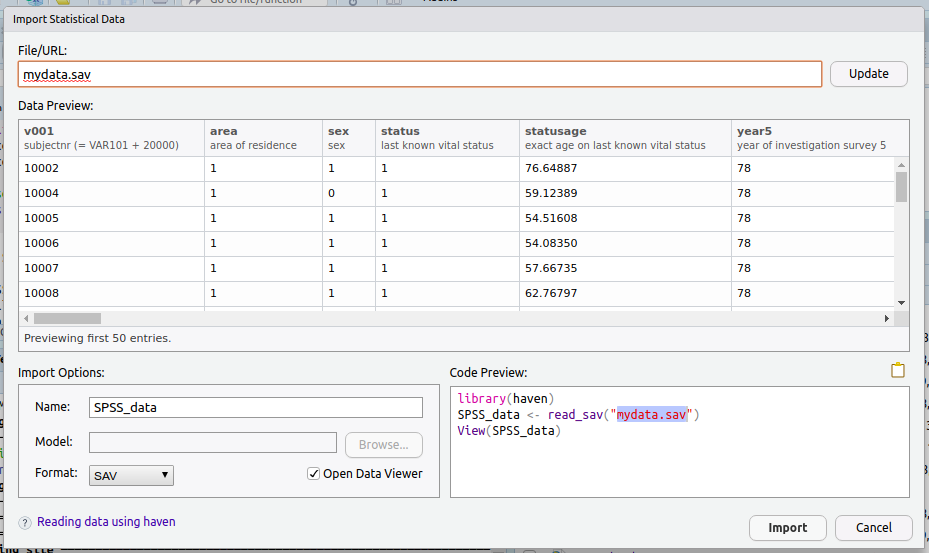

```{r setup, include = FALSE, results = 'markup'}
knitr::opts_chunk$set(
  collapse = TRUE,
  comment = "#>"
)
# set to original language (English)
Sys.setlocale(locale = "C")
```

## SPSS / SAS / Stata

SPSS (Statistical Package for the Social Sciences) is probably the most well-known software package for statistical analysis. SPSS is easier to learn than R, because in SPSS you only have to click a menu to run parts of your analysis. Because of its user-friendlyness, it is taught at universities and particularly useful for students who are new to statistics. From my experience, I would guess that pretty much all (bio)medical students know it at the time they graduate. SAS and Stata are statistical packages popular in big industries.

## Compared to R

As said, SPSS is easier to learn than R. But SPSS, SAS and Stata come with major downsides when comparing it with R:

* **R is highly modular.**

  The [official R network (CRAN)](https://cran.r-project.org/web/packages/) features almost 14,000 packages at the time of writing, our `AMR` package being one of them. All these packages were peer-reviewed before publication. Aside from this official channel, there are also developers who choose not to submit to CRAN, but rather keep it on their own public repository, like GitLab or GitHub. So there may even be a lot more than 14,000 packages out there.
  
  Bottomline is, you can really extend it yourself or ask somebody to do this for you. Take for example our `AMR` package. SPSS, SAS and Stata will never know what a valid MIC value is (so data might not be clean) or what the Gram stain of *E. coli* is. Or the fact that all species of *Klebiella* are resistant to amoxicillin. 
  
* **R is extremely flexible.**

  Because you write the syntax yourself, you can do anything you want. The flexibility in transforming, gathering, grouping, summarising and drawing plots is endless - with SPSS, SAS or Stata you are bound to their algorithms and styles. It may be a bit flexible, but you can never create that very specific publication-ready plot without using other (paid) software.
  
* **R can be easily automated.**

  Over the last years, [R Markdown](https://rmarkdown.rstudio.com/) has really made an interesting development. With R Markdown, you can very easily reproduce your reports, whether it's to Word, Powerpoint, a website, a PDF document or just the raw data to Excel. I use this a lot to generate monthly reports automatically. Just write the code once and enjoy the automatically updated reports at any interval you like.
  
  For an even more professional environment, you could create [Shiny apps](https://shiny.rstudio.com/): live manipulation of data using a custom made website. The webdesign knowledge needed (Javascript, CSS, HTML) is almost *zero*.
  
* **R has a huge community.**

  Many R users just ask questions on website like [stackoverflow.com](https://stackoverflow.com), the largest online community for programmers. At the time of writing, around [275,000 R questions](https://stackoverflow.com/questions/tagged/r?sort=votes) have been asked on this platform (which covers questions and answer for any programming language). In my own experience, most questions are answered within a couple of minutes.
  
* **R understands any data type, including SPSS/SAS/Stata.**

  And that's not vice versa I'm afraid. You can import data from any source into R. As said, from SPSS/SAS/Stata ([link](https://haven.tidyverse.org/)), but also from Excel ([link](https://readxl.tidyverse.org/)), from flat files like CSV, TXT or TSV ([link](https://readr.tidyverse.org/)), or directly from databases or datawarehouses from anywhere on the world ([link](https://dbplyr.tidyverse.org/)). You can even scrape websites to download tables that are live on the internet ([link](https://github.com/hadley/rvest)).
  
  And the best part - you can export from R to all data formats as well. So you can import an SPSS file, do your analysis neatly in R and export back to SPSS. Although you might omit that very last step.

* **R is completely free and open-source.**

  No strings attached. It was created and is being maintained by volunteers who believe that (data) science should be open and publicly available to everybody. SPSS, SAS and Stata are quite expensive. IBM SPSS Staticstics only comes with subscriptions nowadays, varying [between USD 1,300 and USD 8,500](https://www.ibm.com/products/spss-statistics/pricing) per computer *per year*. SAS Analytics Pro costs [around USD 10,000](https://www.sas.com/store/products-solutions/sas-analytics-pro/prodPERSANL.html) per computer. Stata also has a business model with subscription fees, varying [between USD 600 and USD 1,200](https://www.stata.com/order/new/bus/single-user-licenses/dl/) per computer per year, but lower prices come with a limitation of the number of variables you can work with.
  
  If you are working at a midsized or small company, you can save it tens of thousands of dollars by using R instead of SPSS - gaining even more functions and flexibility. And all R enthousiasts can do as much PR as they want (like I do here), because nobody is officially associated with or affiliated by R. It is really free.


If you sometimes write syntaxes in SPSS to run a complete analysis or to 'automate' some of your work, you should perhaps do this in R. You will notice that writing syntaxes in R is a lot more nifty and clever than in SPSS.

## Import data from SPSS/SAS/Stata

### RStudio
To work with R, probably the best option is to use [RStudio](https://www.rstudio.com/products/rstudio/). It is an open-source and free desktop environment which not only allows you to run R code, but also supports project management, version management, package management and convenient import menu to work with other data sources. You can also run [RStudio Server](https://www.rstudio.com/products/rstudio/), which is nothing less than the complete RStudio software available as a website (e.g. in your corporate network or at home).

To import a data file, just click *Import Dataset* in the Environment tab:


If additional packages are needed, RStudio will ask you if they should be installed on beforehand.

In the the window that opens, you can define all options (parameters) that should be used for import and you're ready to go:



If you want named variables to be imported as factors so it resembles SPSS more, use `as_factor()`.

The difference is this:

```{r, eval = FALSE}
SPSS_data
# # A tibble: 4,203 x 4
#     v001 sex       status    statusage
#    <dbl> <dbl+lbl> <dbl+lbl>     <dbl>
#  1 10002 1         1              76.6
#  2 10004 0         1              59.1
#  3 10005 1         1              54.5
#  4 10006 1         1              54.1
#  5 10007 1         1              57.7
#  6 10008 1         1              62.8
#  7 10010 0         1              63.7
#  8 10011 1         1              73.1
#  9 10017 1         1              56.7
# 10 10018 0         1              66.6
# # … with 4,193 more rows

as_factor(SPSS_data)
# # A tibble: 4,203 x 4
#     v001 sex    status statusage
#    <dbl> <fct>  <fct>      <dbl>
#  1 10002 Male   alive       76.6
#  2 10004 Female alive       59.1
#  3 10005 Male   alive       54.5
#  4 10006 Male   alive       54.1
#  5 10007 Male   alive       57.7
#  6 10008 Male   alive       62.8
#  7 10010 Female alive       63.7
#  8 10011 Male   alive       73.1
#  9 10017 Male   alive       56.7
# 10 10018 Female alive       66.6
# # … with 4,193 more rows
```

### Base R

To import data from SPSS, SAS or Stata, you can use the [great `haven` package](https://haven.tidyverse.org/) yourself:

```{r, eval = FALSE}
# download and install the latest version:
install.packages("haven")
# load the package you just installed:
library(haven) 
```

You can now import files as follows:

#### SPSS

To read files from SPSS into R:

```{r, eval = FALSE}
# read any SPSS file based on file extension (best way):
read_spss(file = "path/to/file")

# read .sav or .zsav file:
read_sav(file = "path/to/file")

# read .por file:
read_por(file = "path/to/file")
```

Do not forget about `as_factor()`, as mentioned above.

To export your R objects to the SPSS file format:

```{r, eval = FALSE}
# save as .sav file:
write_sav(data = yourdata, path = "path/to/file")

# save as compressed .zsav file:
write_sav(data = yourdata, path = "path/to/file", compress = TRUE)
```

#### SAS

To read files from SAS into R:

```{r, eval = FALSE}
# read .sas7bdat + .sas7bcat files:
read_sas(data_file = "path/to/file", catalog_file = NULL)

# read SAS transport files (version 5 and version 8):
read_xpt(file = "path/to/file")
```

To export your R objects to the SAS file format:

```{r, eval = FALSE}
# save as regular SAS file:
write_sas(data = yourdata, path = "path/to/file")

# the SAS transport format is an open format 
# (required for submission of the data to the FDA)
write_xpt(data = yourdata, path = "path/to/file", version = 8)
```

#### Stata

To read files from Stata into R:

```{r, eval = FALSE}
# read .dta file:
read_stata(file = "/path/to/file")

# works exactly the same:
read_dta(file = "/path/to/file")
```

To export your R objects to the Stata file format:

```{r, eval = FALSE}
# save as .dta file, Stata version 14:
# (supports Stata v8 until v15 at the time of writing)
write_dta(data = yourdata, path = "/path/to/file", version = 14)
```
